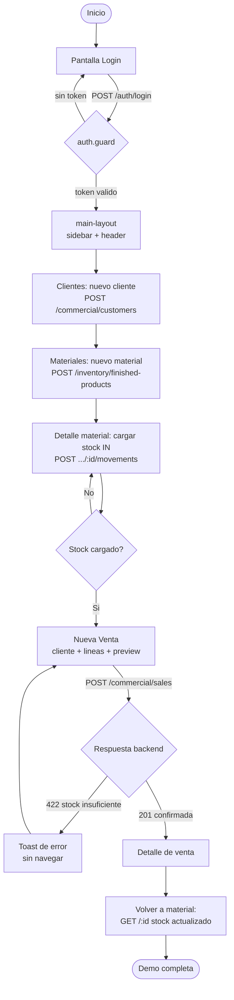

# Plan de Implementación — MVP Demo de Venta de Material (`erp-frontend`)

> Documento de planificación para una **demo funcional de corto alcance** del frontend Angular.
> **Revisado contra el estado real del repositorio** (no sobre supuestos). Contrato de API verificado contra el backend `erp-backend` **ya implementado**.
> Objetivo único: demostrar el flujo de **venta de un material de punta a punta** desde la UI, reutilizando la arquitectura e infraestructura ya existentes.
> Nivel de acabado visual objetivo: **cuidado** (sistema de diseño consistente, no solo PrimeNG por defecto).

> **Hallazgo central de la auditoría:** la capa **`core` (servicios HTTP/Auth/Notificación, interceptores JWT/Error, guards Auth/Permission, wiring de providers) ya está implementada y es sólida.** En cambio, **todo lo visual (layout, shared, pipes, features) está en cero** y `app.component` sigue siendo el placeholder por defecto de Angular. El plan original asumía "scaffolding sin infraestructura base"; eso es incorrecto y se corrige en este documento.

---

## 1. Resumen Ejecutivo

### Objetivo de la demo
Construir la interfaz mínima que permita, desde el navegador, ejecutar el flujo completo de venta: iniciar sesión, dar de alta un cliente, dar de alta un material (producto terminado), cargarle stock inicial, registrar una venta con su detalle y consultar el resultado (venta confirmada + stock actualizado). El frontend **consume** la API del backend ya implementado; no replica lógica de negocio (el descuento de stock y los totales son autoridad del servidor).

### Estado global del frontend (auditoría)
| Capa | Estado | Detalle |
|---|---|---|
| `core` (services, guards, interceptors, modelos auth, wiring) | ✅ **Implementado** | Ver §1.A. |
| `layout` (main-layout, sidebar, header) | 🔴 **Pendiente (0%)** | No existe la carpeta. |
| `shared` (data-table, page-header, confirm-dialog, loading-spinner, pipes) | 🔴 **Pendiente (0%)** | No existe la carpeta. |
| `features` (auth/login, customers, finished-products, sales) | 🔴 **Pendiente (0%)** | No existe la carpeta. |
| Theming / sistema de diseño | 🟡 **Parcial** | Tailwind operativo pero `theme.extend` vacío; PrimeNG con tema `lara-light-blue` por defecto. |
| Routing / shell | 🔴 **Pendiente** | `app.routes.ts` está vacío (`Routes = []`). |
| `app.component` | 🔴 **Placeholder** | Es la pantalla por defecto de Angular; falta montar `<p-toast>`. |

**Avance estimado del flujo end-to-end: ~15%** (motor listo, carrocería en cero).

### 1.A — Infraestructura `core` ya disponible (NO reimplementar)
| Artefacto | Archivo | Notas |
|---|---|---|
| `ApiService` (el "HttpService" del plan) | `core/services/api.service.ts` | Prefija `environment.apiUrl`, desempaqueta `{ data }`, `getPaged()` para `{ data, meta }`, incluye `get/post/patch/put/delete` y `PageMeta` con `totalPages`. |
| `AuthService` | `core/services/auth.service.ts` | `login` → `/auth/me`, `refresh`, `loadProfile`, `hasPermission` (soporta `admin.*`); signals `currentUser`/`isAuthenticated`; tokens en `localStorage`. |
| `NotificationService` | `core/services/notification.service.ts` | `success/error/info/warn` vía PrimeNG `MessageService`. **Requiere un `<p-toast>` montado (hoy ausente).** |
| `jwtInterceptor` | `core/interceptors/jwt.interceptor.ts` | Adjunta `Bearer`; refresca en 401 y reintenta una vez; logout si falla el refresh. |
| `errorInterceptor` | `core/interceptors/error.interceptor.ts` | Mapea errores HTTP a toast; ignora 401 (lo maneja el jwt). |
| `authGuard` / `permissionGuard` | `core/guards/*` | `permissionGuard` lee `route.data.permission`. |
| Modelos auth | `core/models/auth.model.ts` | `ApiResponse<T>`, `AuthUser` (con `permissions[]`), `TokenPair`. |
| Wiring | `app.config.ts` | `provideHttpClient(withInterceptors([...]))`, `provideAnimationsAsync()`, `MessageService`. |
| Environments | `environments/*` | dev → `http://localhost:3000/api` (vía `fileReplacements`). |

### Alcance incluido (trabajo pendiente real)
- **Fundaciones visuales** (hoy inexistentes): `layout` (main-layout + sidebar + header), `shared` (data-table, page-header, confirm-dialog, loading-spinner), pipes `currency-ars` y `date-format`, **montaje de `<p-toast>`**, modelos de dominio en `core/models`, **sistema de diseño/theming** y **shell de rutas lazy** (hoy `app.routes.ts` está vacío).
- **Login** (feature `auth`): solo la **vista** `LoginComponent` + ruta; la lógica de sesión/JWT/refresh ya existe en `AuthService` + interceptores.
- **ABM de Clientes** (feature `commercial/customers`).
- **ABM de Materiales** (feature `inventory/finished-products`) + alta/listado mínimo de **Categorías** + **movimientos de stock** (carga inicial `IN`).
- **Registro de Venta** (feature `commercial/sales`): pantalla multi-línea con selección de cliente, productos, cantidades, preview de totales y confirmación.
- **Consulta**: listados paginados (server-side) y detalle de venta; verificación de stock actualizado.

### Alcance excluido (Fuera de Alcance para la Demo)
| Funcionalidad UI | Motivo |
|---|---|
| Gestión de Usuarios / Roles / Permisos (pantallas) | RBAC ya cubierto por `admin.*`; no se administra desde UI en la demo |
| Empleados | Sin relación con la venta |
| Inventario de Materias Primas | No interviene en la venta de producto terminado |
| Producción / consumo de MP | Fuera del flujo |
| Proveedores / Compras / Pagos | No requerido para vender |
| Caja Ventas / Caja Pagos / Finanzas | Módulo financiero, fuera de alcance |
| Facturación / comprobantes / CAE | Facturación electrónica diferida |
| Reportes PDF/Excel (file-saver, ExcelJS) | No imprescindible (nota: `file-saver` figura en `package.json` pero no se usa) |
| Auditoría (visor de `AuditLog`) | Diferido |
| Dashboard con métricas/analítica | Se incluye, como mucho, una landing simple post-login |

---

## 2. Flujo Funcional de la Demo

1. **Login** → pantalla `/login`; `POST /api/auth/login`; se guarda el access token y se carga el usuario (`GET /api/auth/me`). *(Lógica ya implementada en `AuthService`.)*
2. **Shell autenticado** → `authGuard` habilita el `main-layout` (sidebar + header) y la navegación.
3. **Crear cliente** → `/commercial/customers` → formulario reactivo → `POST /api/commercial/customers`.
4. **(Opcional) Categoría** → usar una sembrada o crearla rápido desde el alta de material.
5. **Crear material** → `/inventory/finished-products` → `POST /api/inventory/finished-products` (nace con `currentStock = 0`).
6. **Cargar stock inicial** → desde el detalle del material → `POST /api/inventory/finished-products/:id/movements` (tipo `IN`).
7. **Crear venta** → `/commercial/sales/new` → seleccionar cliente, agregar líneas (material + cantidad), ver preview de totales → `POST /api/commercial/sales`.
8. **Consultar** → detalle de venta (`GET /api/commercial/sales/:id`) y stock actualizado del material (`GET /api/inventory/finished-products/:id`).



> **Nota de rutas:** la UI consume los paths reales del backend (`/api/commercial/...`, `/api/inventory/...`, `/api/categories`), **no** rutas planas tipo `/api/customers`. Verificado en `erp-backend/src/app.ts`.

---

## 3. Contrato de API verificado contra el backend

> Validado leyendo las rutas, DTOs y servicios reales. Las correcciones respecto del plan original están marcadas con **⚠**.

| Recurso | Endpoints reales | Notas |
|---|---|---|
| Auth | `POST /api/auth/login`, `POST /api/auth/refresh`, `GET /api/auth/me` | `login` devuelve `TokenPair`; el perfil se obtiene aparte con `/me`. Ya implementado en `AuthService`. |
| Clientes | `GET /api/commercial/customers[/:id]`, `POST`, **⚠ `PATCH /:id`**, `DELETE /:id` | El backend usa **`PATCH`** para update (no `PUT`). `ApiService.patch()` ya existe. Permisos: `commercial.read/create/update/delete`. |
| Categorías | `GET /api/categories`, `POST /api/categories` | No paginado. Permisos `inventory.read/create`. |
| Productos terminados | `GET /api/inventory/finished-products[/:id]`, `POST`, **⚠ `PATCH /:id`**, `DELETE /:id` | Update por **`PATCH`**. Permisos `inventory.*`. |
| Movimientos de stock | `GET /api/inventory/finished-products/:id/movements`, `POST .../:id/movements` | `POST` requiere `inventory.update`. Tipos `IN`/`ADJUST` para la demo. |
| Ventas | `GET /api/commercial/sales[/:id]`, `POST /api/commercial/sales` | **No hay update/delete** de ventas. Permisos `commercial.read/create`. |

**Detalles del `POST /api/commercial/sales` (verificados en `sales.dto.ts` / `sales.service.ts`):**
- Body: `{ customerId: uuid, paymentMethod: PaymentMethod, items: [{ finishedProductId: uuid, quantity: number > 0 }] }` (mínimo 1 ítem).
- **⚠ `paymentMethod` es un enum**, no texto libre: `CASH | TRANSFER | CARD | CHECK | ACCOUNT`. El selector debe ofrecer estos valores; default `CASH`.
- **Stock insuficiente → `422`** con mensaje por producto (`Stock insuficiente para <nombre> (disponible X, requerido Y)`) y **rollback completo** en el servidor. La UI muestra toast y **no** navega.
- El backend descuenta `currentStock` y genera movimientos `OUT`; los totales (`subtotal`/`tax`/`total`) son autoridad del servidor.

**⚠ Proxy de desarrollo:** el plan original proponía `proxy.conf.json`. **No existe ni hace falta**: dev apunta directo a `http://localhost:3000/api` y el backend ya tiene **CORS configurado** (`app.ts`). Tarea eliminada.

---

## 4. Módulos (Features) a Implementar

> Cada feature se declara **lazy-loaded** (convención obligatoria), usa **Reactive Forms**, **Signals** para estado local y **paginación server-side** en listados. Las rutas declaran `data: { permission: 'modulo.accion' }` y el `permissionGuard` (ya implementado) las valida (con `admin.*` el usuario de la demo pasa todo).

### 4.1 `core` + `shared` + `layout`
- **`core`:** ✅ **COMPLETADO — NO REQUIERE TRABAJO** (salvo agregar modelos de dominio en `core/models`, ver §5.0).
- **`shared` + `layout` + theming + rutas:** 🔴 **Pendiente.** Es el foco de la nueva **Fase 0**.

### 4.2 `auth` (Login)
- **Objetivo:** autenticar e iniciar sesión. *(La lógica ya existe; falta la vista.)*
- **Vistas:** `LoginComponent` (form reactivo email + password, estado de carga, error inline) → `AuthService.login`.
- **Estado:** 🟡 **Parcial** — `AuthService` + interceptores listos; falta `LoginComponent` y la ruta `/login`.
- **Prioridad:** **Alta.**

### 4.3 `commercial/customers` (ABM Clientes)
- **Vistas:** `CustomerListComponent` (data-table paginada + búsqueda), `CustomerFormComponent` (crear/editar), confirmación de baja lógica.
- **API:** `GET/POST/PATCH/DELETE /api/commercial/customers[/:id]`.
- **Estado:** 🔴 **Pendiente.** **Prioridad:** **Alta.**

### 4.4 `inventory/finished-products` (ABM Materiales + Categorías + Stock)
- **Vistas:** `ProductListComponent` (`sku`, nombre, categoría, `salePrice`, `currentStock`), `ProductFormComponent` (`currentStock` **no** editable, manejo de 409 por `sku` duplicado), `StockMovementDialog` (`IN`/`ADJUST`); categorías vía combo (`GET /api/categories`) con alta rápida opcional.
- **API:** `GET/POST/PATCH/DELETE /api/inventory/finished-products[/:id]`; `POST/GET .../:id/movements`; `GET/POST /api/categories`.
- **Estado:** 🔴 **Pendiente.** **Prioridad:** **Alta.**

### 4.5 `commercial/sales` (Registro de Venta — NÚCLEO)
- **Vistas:** `SaleFormComponent` (selección de cliente, tabla editable de líneas: material + cantidad + precio congelado + subtotal de línea, **preview** de subtotal/total con `decimal.js`, selector de `paymentMethod` **requerido**, botón Confirmar), `SaleListComponent` (paginada), `SaleDetailComponent` (cabecera + líneas + cliente).
- **API:** `POST /api/commercial/sales`, `GET /api/commercial/sales`, `GET /api/commercial/sales/:id`.
- **Estado:** 🔴 **Pendiente.** **Prioridad:** **Crítica** (corazón de la demo).

---

## 5. Diseño de Vistas, Componentes y Modelos

### 5.0 Modelos de dominio a agregar (`core/models`)
> Hoy solo existen los modelos de auth. Agregar (los montos llegan como **string** — Decimal serializado):

```ts
// Reutilizar PageMeta / PagedResponse de core/services/api.service.ts (ya incluyen totalPages)

interface Customer {
  id: string; name: string; taxId?: string;
  email?: string; phone?: string; address?: string; isActive: boolean;
}

interface Category { id: string; name: string; type: 'RAW_MATERIAL' | 'FINISHED_PRODUCT'; }

interface FinishedProduct {
  id: string; sku: string; name: string; categoryId: string;
  unit: string; salePrice: string;        // Decimal como string
  currentStock: string; isActive: boolean; // Decimal como string
}

type MovementType = 'IN' | 'OUT' | 'ADJUST';
interface FinishedProductMovement {
  id: string; type: MovementType; quantity: string; reference?: string; createdAt: string;
}

type PaymentMethod = 'CASH' | 'TRANSFER' | 'CARD' | 'CHECK' | 'ACCOUNT';
interface SaleItemInput { finishedProductId: string; quantity: string; }
interface SaleDetail {
  id: string; finishedProductId: string; quantity: string;
  unitPrice: string; lineTotal: string;
}
interface Sale {
  id: string; customerId: string; soldAt: string;
  status: 'DRAFT' | 'CONFIRMED'; paymentMethod: PaymentMethod;
  subtotal: string; tax: string; total: string; details: SaleDetail[];
}
```

### 5.1 Árbol objetivo (sobre lo ya existente)
```
erp-frontend/src/app/
├── core/                         # ✅ EXISTE
│   ├── services/                 # ✅ api, auth, notification
│   ├── guards/                   # ✅ auth.guard, permission.guard
│   ├── interceptors/             # ✅ jwt.interceptor, error.interceptor
│   └── models/                   # 🟡 auth.model.ts existe; AGREGAR modelos de dominio
├── shared/                       # 🔴 CREAR
│   ├── components/               # data-table, page-header, confirm-dialog, loading-spinner
│   └── pipes/                    # currency-ars, date-format
├── layout/                       # 🔴 CREAR  main-layout, sidebar, header
└── features/                     # 🔴 CREAR
    ├── auth/                     # login
    ├── commercial/
    │   ├── customers/            # list, form
    │   └── sales/                # form (nueva venta), list, detail
    └── inventory/
        └── finished-products/    # list, form, stock-movement-dialog (+ categorías embebidas)
```

### 5.2 Componentes compartidos (a crear)
| Componente | Responsabilidad | Estado |
|---|---|---|
| `DataTableComponent` | Tabla genérica con **paginación server-side** (PrimeNG `p-table` lazy), búsqueda, slots de columnas, estados loading/empty | 🔴 Pendiente |
| `PageHeaderComponent` | Título + breadcrumb + acción primaria (ej. "Nuevo") | 🔴 Pendiente |
| `ConfirmDialogComponent` | Confirmación de acciones destructivas (baja lógica) | 🔴 Pendiente |
| `LoadingSpinnerComponent` | Indicador de carga / skeletons | 🔴 Pendiente |

> La paginación puede resolverse con el paginador interno de `p-table` (lazy), evitando un `PaginationComponent` separado salvo que se necesite fuera de tablas.

### 5.3 Pipes (a crear)
- `currencyArs`: formatea ARS (`$ 1.234,56`) respetando `es-AR`.
- `dateFormat`: formatea con **Day.js** (`DD/MM/YYYY`, `DD/MM/YYYY HH:mm`). `dayjs` ya está en `package.json`.

### 5.4 Diseño visual (requisito "cuidado")
- **⚠ Versión real:** **Angular 19** + **PrimeNG 17.18.11**. PrimeNG 17 usa el **styled-mode clásico con CSS de tema** (`lara-light-blue` ya cargado en `angular.json`), **no** el sistema de presets/tokens de PrimeNG v18+. El theming se hace con **variables CSS de PrimeNG 17 + `theme.extend` de Tailwind**, no con la API de presets.
- **Paleta:** identidad industrial/construcción — un primario sobrio + neutros, con estados claros (éxito/alerta/error). Definida una sola vez como variables CSS / `theme.extend` de Tailwind (hoy vacío).
- **Tipografía y espaciado:** escala consistente y grid de espaciado uniforme.
- **Estados de UI:** loading (skeletons/spinner), vacío (empty states con CTA), error (toasts vía `NotificationService` — **montar `<p-toast>`**), validación inline en formularios.
- **Responsive y accesibilidad:** layout mobile-first, sidebar colapsable, labels asociados, foco visible y contraste suficiente.

---

## 6. Capa de Servicios de Dominio (a crear sobre `ApiService`)

> Todos consumen el `ApiService` existente (que ya desempaqueta `{ data }` y `{ data, meta }`). El header `Authorization` lo agrega el `jwtInterceptor`; los errores genéricos los muestra el `errorInterceptor`.

### 6.1 `AuthService` — ✅ **YA IMPLEMENTADO**
`login(email,password)`, `refresh()`, `loadProfile()` (`/me`), `hasPermission()`, signals `currentUser`/`isAuthenticated`. **No reimplementar.** Solo falta consumirlo desde `LoginComponent`.

### 6.2 `CustomerService` (a crear)
| Método | Endpoint | Notas |
|---|---|---|
| `list(page,limit,search)` | `GET /api/commercial/customers` | `getPaged<Customer>` |
| `getById(id)` | `GET /api/commercial/customers/:id` | |
| `create(dto)` | `POST /api/commercial/customers` | body: `name` (req), `taxId?`, `email?`, `phone?`, `address?` |
| `update(id,dto)` | **`PATCH`** `/api/commercial/customers/:id` | ⚠ PATCH, no PUT |
| `deactivate(id)` | `DELETE /api/commercial/customers/:id` | baja lógica |
- **Validaciones form:** `name` requerido (min 2); `email` formato si se carga.

### 6.3 `CategoryService` (a crear)
| Método | Endpoint | Notas |
|---|---|---|
| `list()` | `GET /api/categories` | no paginado |
| `create(dto)` | `POST /api/categories` | `name` (req), `type` (`FINISHED_PRODUCT` en la demo) |

### 6.4 `FinishedProductService` (a crear, + stock)
| Método | Endpoint | Notas |
|---|---|---|
| `list(page,limit,search)` | `GET /api/inventory/finished-products` | `getPaged<FinishedProduct>` |
| `getById(id)` | `GET /api/inventory/finished-products/:id` | incluye `currentStock` |
| `create(dto)` | `POST /api/inventory/finished-products` | `sku`, `name`, `categoryId`, `unit`, `salePrice`; **sin** `currentStock` |
| `update(id,dto)` | **`PATCH`** `/api/inventory/finished-products/:id` | ⚠ PATCH; no toca stock |
| `deactivate(id)` | `DELETE /api/inventory/finished-products/:id` | baja lógica |
| `addMovement(id,dto)` | `POST /api/inventory/finished-products/:id/movements` | `{ type:'IN'|'ADJUST', quantity, reference? }` |
| `listMovements(id,page,limit)` | `GET /api/inventory/finished-products/:id/movements` | historial |
- **Validaciones form:** `sku` requerido (manejar **409** duplicado → error de campo); `salePrice` ≥ 0; `categoryId` requerido; `unit` requerido. `currentStock` **read-only**.

### 6.5 `SaleService` (a crear — núcleo)
| Método | Endpoint | Notas |
|---|---|---|
| `create(dto)` | `POST /api/commercial/sales` | `{ customerId, paymentMethod, items:[{ finishedProductId, quantity }] }` |
| `list(page,limit)` | `GET /api/commercial/sales` | `getPaged<Sale>` |
| `getById(id)` | `GET /api/commercial/sales/:id` | con `details` |
- **Comportamiento en la UI:**
  - `paymentMethod` **requerido** (enum `CASH|TRANSFER|CARD|CHECK|ACCOUNT`, default `CASH`).
  - El **precio** se muestra desde `salePrice`; subtotal/total en pantalla son solo **preview** con `decimal.js` (ya en `package.json`); el total guardado es el del backend.
  - **422 (stock insuficiente)** → toast con el producto afectado y **no** se navega (rollback del lado del servidor).
  - Tras 201, navegar al detalle de la venta.

---

# 7. Gaps para la Demo

Flujo objetivo: **Cliente → Material → Stock → Venta**. Lo que falta para cerrarlo:

### Pantallas faltantes
- `LoginComponent`; `CustomerListComponent`/`CustomerFormComponent`; `ProductListComponent`/`ProductFormComponent`; `SaleFormComponent` (núcleo)/`SaleListComponent`/`SaleDetailComponent`.

### Componentes / estructura faltantes
- **Layout completo:** `MainLayout` + `Sidebar` (navegación) + `Header` (usuario/logout, consume `AuthService`).
- **`<p-toast>` sin montar:** `NotificationService` está listo pero **ningún componente renderiza el toast** → hoy los errores no se ven. **Bloqueante de UX.**
- **Shared:** `DataTable`, `PageHeader`, `ConfirmDialog`, `LoadingSpinner`.
- `StockMovementDialog`.

### Formularios faltantes
- Reactive Forms de: login, cliente, producto, movimiento de stock y la **tabla editable de líneas** de la venta.

### Integraciones API faltantes
- `CustomerService`, `CategoryService`, `FinishedProductService`, `SaleService` (los 4 sobre el `ApiService` existente) + modelos de dominio en `core/models`.

### Validaciones faltantes
- Login (email/password); cliente (`name` min 2, `email`); producto (`sku`/`categoryId`/`unit` req, `salePrice ≥ 0`, `currentStock` read-only, **409 sku**); venta (`customerId`, ≥1 línea, `quantity > 0`, `paymentMethod` req).

### Estados de carga faltantes
- Spinners/skeletons en listados y botones de submit (deshabilitar durante request).

### Manejo de errores faltante
- El `errorInterceptor` ya hace toast genérico; falta el específico: **422 stock insuficiente** (toast + no navegar) y **409 sku** (error inline de campo).

### Navegación faltante
- `app.routes.ts` está vacío → definir shell: `/login` (público) + grupo protegido por `authGuard`/`permissionGuard` con lazy-loading (`commercial/customers`, `commercial/sales`, `inventory/finished-products`), redirección post-login y `/` → landing simple.

---

# 8. Validación del Flujo End-to-End

| Capacidad | Estado | Detalle |
|---|---|---|
| Gestión de Clientes | 🔴 Falta | API backend lista; sin UI ni `CustomerService`. |
| Gestión de Materiales | 🔴 Falta | Ídem; sin UI ni `FinishedProductService`. |
| Consulta de Stock | 🔴 Falta | `currentStock` llega en el DTO; sin pantalla que lo muestre. |
| Registro de Ventas | 🔴 Falta | Sin `SaleFormComponent` ni `SaleService` (pieza central). |
| Actualización visual del stock post-venta | 🔴 Falta | Depende de las dos pantallas anteriores. |
| Login / sesión | 🟡 Parcial | **Lógica completa** (`AuthService` + interceptores + guards); falta `LoginComponent` y ruta. |
| Infra HTTP / Auth / Errores | ✅ Funciona | `core` operativo; solo falta montar `<p-toast>` para ver notificaciones. |

---

## 9. Roadmap Reestructurado (solo trabajo pendiente)

> Convenciones obligatorias a respetar (ya presentes en el repo): standalone components, **Signals** para estado local, **Reactive Forms**, lazy-loading, **server-side pagination**, consumo vía `ApiService`, errores vía `NotificationService`/`errorInterceptor`, rutas con `data.permission`. **No** introducir NgRx, ni otra lib HTTP, ni otro sistema de toasts.

### ✅ Fase 1 original — `core` / servicios / guards / interceptores
**COMPLETADA — NO REQUIERE TRABAJO** (lo que falta de aquella fase —layout, shared, pipes, theming, rutas— se mueve a la nueva **Fase 0**).

### Fase 0 — Fundaciones visuales y de navegación *(lo que faltaba de la Fase 1 original)*
- **Objetivo:** convertir el `core` existente en una app navegable y con identidad visual.
- **Alcance:** limpiar `app.component` (placeholder → `<router-outlet>` + `<p-toast>`); `MainLayout` + `Sidebar` + `Header` con logout (consume `AuthService`); shared `DataTable`/`PageHeader`/`ConfirmDialog`/`LoadingSpinner`; pipes `currencyArs`/`dateFormat`; theming PrimeNG 17 + tokens en `theme.extend` de Tailwind; modelos de dominio en `core/models`; `app.routes.ts` con shell lazy (`/login` + grupo `authGuard`).
- **Componentes:** `app.component`, `layout/*`, `shared/*`, `core/models/*`, `tailwind.config.js`, `styles.css`.
- **Dependencias:** ninguna (sobre `core` existente).
- **Riesgos:** alcance-creep visual (límite: sistema consistente, no marca a medida); choque PrimeNG/Tailwind (mitigado por usar styled-mode v17, no presets).
- **Estimación:** **Alta.**

### Fase 1 — Login *(antes Fase 2)*
- **Objetivo:** entrar al shell con la lógica de auth ya existente.
- **Alcance:** `LoginComponent` (Reactive Form, loading, error inline) → `AuthService.login`; redirección post-login; ruta `/login`.
- **Componentes:** `features/auth/login`, `AuthService` (reutilizado tal cual), `MainLayout`.
- **Dependencias:** Fase 0.
- **Riesgos:** bajos (solo falta la vista).
- **Estimación:** **Baja.**

### Fase 2 — ABM Clientes *(antes Fase 3)*
- **Objetivo:** alta/edición/baja de clientes (mínimo: alta + listado para la venta).
- **Alcance:** `CustomerService` (list/getById/create/**patch**/deactivate); `CustomerListComponent` (DataTable server-side + búsqueda); `CustomerFormComponent`; baja con `ConfirmDialog`.
- **Componentes:** `features/commercial/customers/*`, shared, `ApiService`.
- **Dependencias:** Fases 0–1.
- **Riesgos:** bajos.
- **Estimación:** **Media.**

### Fase 3 — Materiales + Categorías + Stock *(antes Fase 4)*
- **Objetivo:** crear material, categorizarlo y cargarle stock `IN`.
- **Alcance:** `CategoryService` (combo + alta rápida); `FinishedProductService` (incluye `addMovement`/`listMovements`/**patch**); `ProductListComponent` (con `currentStock`); `ProductFormComponent` (`currentStock` read-only, **409 sku** inline); `StockMovementDialog` + refresco de stock.
- **Componentes:** `features/inventory/finished-products/*`, shared.
- **Dependencias:** Fases 0–1.
- **Riesgos:** Decimal como string (mostrar como string; parsear solo para UI).
- **Estimación:** **Media-Alta.**

### Fase 4 — Registro de Venta (NÚCLEO) *(antes Fase 5)*
- **Objetivo:** vender de punta a punta y verificar el resultado.
- **Alcance:** `SaleService` (create/list/getById); `SaleFormComponent` (selector de cliente, tabla editable de líneas con precio congelado y subtotales, **preview** con `decimal.js`, `paymentMethod` requerido —enum real, default `CASH`—); manejo de **422** (toast, sin navegar); `SaleDetailComponent` y `SaleListComponent`; navegación al detalle tras 201.
- **Componentes:** `features/commercial/sales/*`, reutiliza selectores de clientes/productos.
- **Dependencias:** Fases 2 y 3.
- **Riesgos:** lógica del form multilínea + manejo de Decimal/preview (el más alto del proyecto).
- **Estimación:** **Alta.**

### Fase 5 — Pulido visual + verificación E2E *(antes Fase 6)*
- **Objetivo:** dejar la demo prolija y reproducible.
- **Alcance:** repaso de estados loading/empty/error en todas las pantallas, responsive y accesibilidad básicos, consistencia de paleta/tipografía; recorrido E2E manual (login → cliente → material → stock → venta → consulta); opcional: tests de `LoginComponent`/`SaleFormComponent` y README de la demo.
- **Dependencias:** Fases 0–4.
- **Estimación:** **Media.**

### Ruta crítica mínima
`F0 → F1 → F2 → F3 → F4`. Con eso el flujo corre punta a punta desde la UI. **F5** (pulido + E2E) materializa el requisito de "cuidado visualmente" y la robustez.

---

## 10. Mapa de fases del plan original → estado real

| Fase original | Veredicto |
|---|---|
| F1 — Fundaciones (`core` services/guards/interceptores + theming + shell) | 🟡 **Parcial** — `core` **COMPLETADO**; pendiente solo layout/shared/pipes/theming/rutas → **nueva Fase 0** |
| F2 — Login y sesión | 🟡 **Parcial** — lógica de sesión **COMPLETADA**; falta `LoginComponent` + ruta → **nueva Fase 1** |
| F3 — ABM Clientes | 🔴 Pendiente (⚠ `PUT`→`PATCH`) → **Fase 2** |
| F4 — Materiales/Categorías/Stock | 🔴 Pendiente (⚠ `PUT`→`PATCH`) → **Fase 3** |
| F5 — Registro de Venta | 🔴 Pendiente (⚠ enum `paymentMethod` real; 422 confirmado) → **Fase 4** |
| F6 — Pulido + E2E | 🔴 Pendiente → **Fase 5** |

> **Ninguna fase original está 100% completa, pero F1 y F2 tienen su núcleo difícil ya resuelto** (interceptores, refresh con retry, guards, sesión con signals) — la mayor reutilización disponible.

---

## 11. Riesgos y Supuestos

### Riesgos técnicos
- **Manejo de Decimales en el cliente:** tratar montos como string; usar `decimal.js` solo para preview; confiar en los totales del backend.
- **Refresh de token y carrera en 401:** el `jwtInterceptor` ya reintenta una vez; si se observan refresh múltiples en paralelo, serializar (un refresh en vuelo). *(Riesgo menor: hoy ya hay manejo básico.)*
- **PrimeNG 17 + Tailwind:** alinear theming una sola vez (Fase 0) con styled-mode v17 (no presets v18).
- **Paginación server-side:** usar `PagedResponse<T>`/`PageMeta` ya tipados en `ApiService` (incluyen `totalPages`).
- **`<p-toast>` ausente:** sin montarlo, el `NotificationService` no muestra nada. Resolver en Fase 0.

### Riesgos funcionales
- **Alcance creep visual:** límite = sistema de diseño consistente con PrimeNG/Tailwind, no identidad de marca a medida.
- **`paymentMethod` requerido y tipado:** validación obligatoria con default `CASH` y solo valores del enum real.

### Dependencias externas
- **Backend `erp-backend` corriendo** en `http://localhost:3000` (CORS ya habilitado; sin proxy). El front no funciona sin él.
- Node 20.11.0 + pnpm 9.x; ejecución vía workspace (`pnpm --filter erp-frontend start`).

### Supuestos (corregidos tras auditoría)
- **Estado del repo:** ~~"scaffolding sin infra base"~~ → **`core` completo + capa visual en cero**. *(Auditado contra archivos reales.)*
- **Contrato de API tomado del backend implementado y verificado** (update por `PATCH`; `paymentMethod` enum; 422 stock insuficiente; rutas `/api/...`).
- **RBAC:** `authGuard`/`permissionGuard` ya implementados; con `admin.*` el usuario de la demo pasa todos los checks.
- **`currentStock` no editable** desde el form de material (solo por movimientos).
- **Sin facturación, reportes, cajas ni auditoría** en la UI de la demo.

---

## 12. Backlog Priorizado

| Prioridad | Historia Técnica | Valor para la Demo | Dependencias |
|---|---|---|---|
| ✅ Hecho | Infra `core`: `ApiService` + interceptores (`jwt`/`error`) + guards + `AuthService` + `provideHttpClient` | Base de todo el consumo de API | — |
| P0 | Fase 0: `app.component` limpio + `<p-toast>` + `layout` + shell de rutas lazy | Marco navegable y notificaciones visibles | core |
| P0 | Sistema de diseño (tokens Tailwind + variables PrimeNG 17) | Requisito "cuidado visualmente"; evita retrabajo | core |
| P0 | `SaleFormComponent` + `SaleService` (`POST /sales`, preview, 422) | **Núcleo de la demo** | Clientes, Materiales, Stock |
| P1 | shared `DataTable` + `PageHeader` + `ConfirmDialog` + pipes (`currencyArs`/`dateFormat`) | Base reutilizable de listados/forms | core |
| P1 | `LoginComponent` + ruta `/login` (lógica ya existe) | Puerta de entrada al flujo | core, layout |
| P1 | `CustomerService` + list/form de Clientes | Necesario para asociar la venta | shared + core |
| P1 | `FinishedProductService` + list/form de Materiales | El material que se vende | shared + core |
| P1 | `StockMovementDialog` (`IN`) + refresco de `currentStock` | Permite tener stock para vender | Materiales |
| P1 | `SaleDetailComponent` + `GET /:id` | Cierra el flujo (evidencia) | Ventas |
| P2 | `CategoryService` + combo/alta rápida de categorías | Clasificar materiales; puede resolverse con seed | core |
| P2 | `SaleListComponent` + listados paginados | Mejora la presentación | Servicios respectivos |
| P2 | Estados loading/empty/error consistentes + responsive | Calidad visual | Features base |
| P3 | Tests de componentes/servicios clave (login, sale form) | Robustez y reproducibilidad | Flujo completo |
| P3 | README de la demo del front | Reproducir la demo sin fricción | Flujo completo |

> **Ruta crítica mínima para una demo "viva":** Fase 0 (layout + theming + toast + rutas) → Login → Clientes → Materiales/Stock → Venta + Detalle. El `core` ya resuelto acelera todas las features (son "clonar el patrón" sobre `ApiService`).
