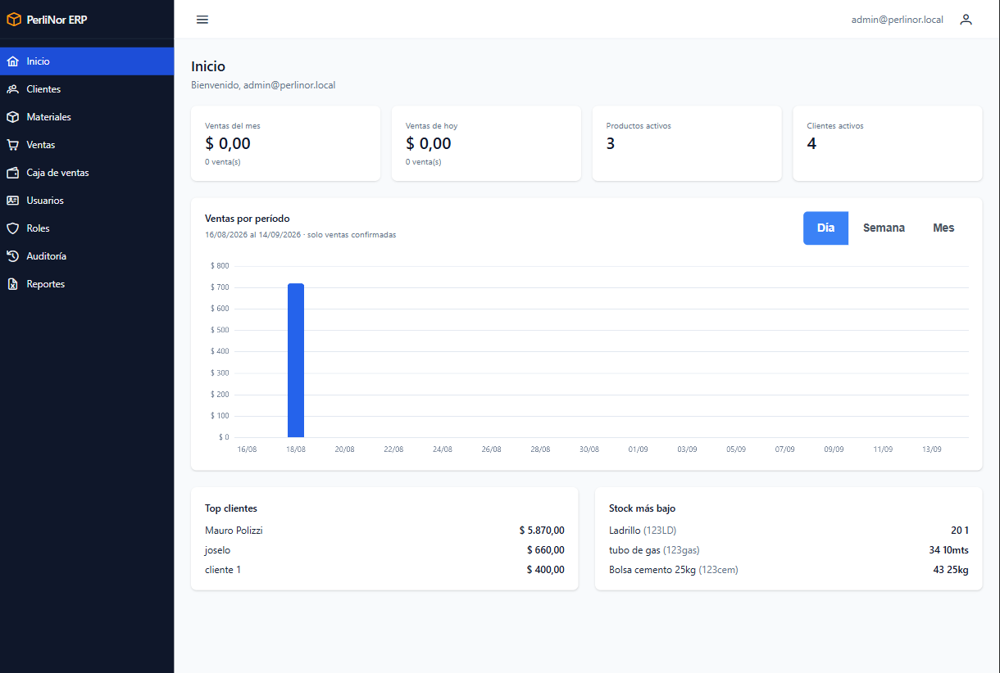

# Presentación del sistema

## Qué es PerliNor ERP

PerliNor ERP es el sistema de gestión de la fábrica. Reúne en un solo lugar la información que antes
estaba repartida entre planillas y papeles: el catálogo de materiales, el stock disponible, los
clientes, las ventas y el movimiento de la caja.

Se usa desde el navegador, como cualquier página web. No hay nada que instalar en tu computadora.

<figure>
  
  <figcaption>Pantalla de inicio del sistema, con el menú de navegación a la izquierda.</figcaption>
</figure>

## Para qué sirve

El sistema te permite:

- **Consultar y mantener el catálogo de materiales**, con su precio y su stock.
- **Registrar los ingresos de stock** cuando entra mercadería.
- **Administrar los clientes** de la fábrica.
- **Registrar las ventas**, que descuentan el stock automáticamente.
- **Anular una venta** si se registró por error, reponiendo el stock.
- **Consultar la caja de ventas**, que se alimenta sola con cada operación.
- **Ver indicadores de gestión**: cuánto se vendió, quiénes son los principales clientes, qué
  materiales están por agotarse.
- **Descargar reportes** para abrir en una planilla de cálculo.

## Qué hace el sistema por vos

Hay tres cosas que conviene tener claras desde el principio, porque son las que más cambian respecto
de trabajar con planillas.

**El stock se actualiza solo.** Cuando registrás una venta, el sistema descuenta los materiales
vendidos. No hay que ajustar nada a mano.

**La caja se alimenta sola.** Cada venta registra su ingreso en la caja de ventas. No se cargan
movimientos manualmente.

**Nada se borra.** Cuando das de baja un cliente o un material, el sistema lo desactiva pero conserva
toda su información y su historial. Una venta vieja siempre se puede consultar, aunque el cliente ya
no esté activo.

## Los módulos

| Módulo | Para qué sirve |
|---|---|
| **Inicio** | Indicadores de gestión y evolución de las ventas |
| **Clientes** | Alta, consulta, modificación y baja de clientes |
| **Materiales** | Catálogo de materiales, precios y movimientos de stock |
| **Ventas** | Registro, consulta y anulación de ventas |
| **Caja de ventas** | Saldo y movimientos de dinero por ventas |
| **Reportes** | Descarga de información en planilla de cálculo |
| **Usuarios** | Altas y modificaciones de las cuentas de acceso |
| **Roles** | Consulta de qué puede hacer cada rol |
| **Auditoría** | Registro de quién hizo qué y cuándo |

## Qué vas a ver según tu rol

El sistema le muestra a cada persona solamente lo que corresponde a su área. Por eso, **el menú no es
igual para todos**.

| Tu rol | Módulos que ves |
|---|---|
| **Administración** | Todos |
| **Ventas** | Inicio, Clientes, Materiales, Ventas |
| **Stock** | Inicio, Materiales |
| **Producción** | Inicio, Materiales |
| **Finanzas** | Inicio, Clientes, Materiales, Ventas, Caja de ventas, Reportes |

Si necesitás acceder a un módulo que no ves en tu menú, hablá con la persona a cargo de la
administración del sistema: es ella quien asigna los roles.

## Cómo está organizado este manual

Los capítulos siguen el orden en que vas a usar el sistema. Los capítulos 2 y 3 explican cómo entrar.
El capítulo 4 te muestra cómo moverte por la pantalla, y conviene leerlo aunque tengas experiencia
con otros sistemas: hay un par de comportamientos que se explican una sola vez, ahí.

Del capítulo 5 al 11 está cada módulo, con sus procedimientos paso a paso. El capítulo 12 reúne las
dudas más frecuentes y qué hacer ante los problemas más comunes.

Al final hay un glosario con los términos que usa el sistema.
