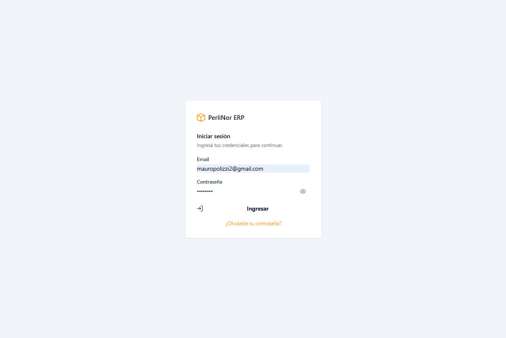
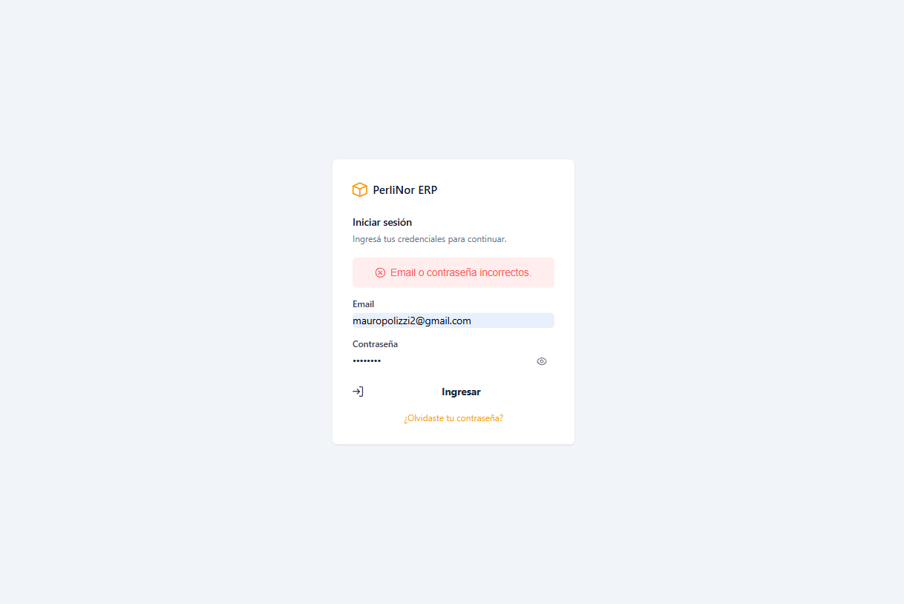

# Requisitos y acceso

## Qué necesitás

| Requisito | Detalle |
|---|---|
| Una computadora con navegador | Chrome, Edge o Firefox, actualizados |
| Conexión a la red donde está publicado el sistema | — |
| Tu usuario y contraseña | Te los entrega la persona a cargo de la administración |

No hay nada que instalar ni configurar.

## Cómo entrar

**Paso 1.** Abrí el navegador e ingresá la dirección del sistema. Vas a ver la pantalla de acceso.

<figure class="media">
  
  <figcaption>Pantalla de acceso al sistema.</figcaption>
</figure>

**Paso 2.** Escribí tu email y tu contraseña.

**Paso 3.** Hacé clic en **Ingresar**.

Si los datos son correctos, entrás directamente a la pantalla de **Inicio**, con tu menú ya armado
según tu rol.

## Si no podés entrar

<figure class="media">
  
  <figcaption>Mensaje que aparece cuando el email o la contraseña no son correctos.</figcaption>
</figure>

| Mensaje | Qué significa | Qué hacer |
|---|---|---|
| «Email o contraseña incorrectos.» | Los datos no coinciden con ninguna cuenta activa | Revisá que el email esté bien escrito y volvé a intentar. Si no lo resolvés, usá **¿Olvidaste tu contraseña?** (capítulo 3) |
| «No se pudo iniciar sesión. Intentá nuevamente.» | El sistema no pudo responder | Esperá unos segundos y reintentá. Si persiste, avisá a la administración |

> **Por qué el mensaje no dice cuál de los dos datos está mal.** Es a propósito. Si el sistema
> avisara «ese email no existe», cualquiera podría averiguar qué direcciones están registradas. El
> mensaje es el mismo en los dos casos, por seguridad.

Si el email es correcto y la contraseña también, pero igual no entrás, puede que tu cuenta haya sido
dada de baja. En ese caso, consultá con la administración.

## Sobre tu sesión

Una vez que entrás, **el sistema mantiene tu sesión abierta**. Podés cerrar la pestaña y volver más
tarde sin tener que escribir de nuevo tu contraseña, o recargar la página sin perder nada.

La sesión se renueva sola mientras la uses. Si pasás varios días sin entrar, te va a pedir la
contraseña otra vez.

## Cómo salir

Hacé clic en el ícono de usuario, arriba a la derecha, y elegí **Cerrar sesión**.

Conviene cerrar sesión si compartís la computadora con otras personas.

## Tu contraseña

Estas son las reglas que aplica el sistema:

- La contraseña debe tener **al menos 8 caracteres**.
- Si la olvidás, la podés recuperar vos mismo desde la pantalla de acceso (capítulo 3).
- Si necesitás cambiarla sin haberla olvidado, usá también **¿Olvidaste tu contraseña?**: el
  procedimiento es el mismo.

> **Importante.** Si cambiás tu contraseña, las sesiones que ya estén abiertas en otros equipos
> siguen funcionando durante unos días. Si sospechás que alguien accedió a tu cuenta, además de
> cambiar la contraseña avisá a la administración.
