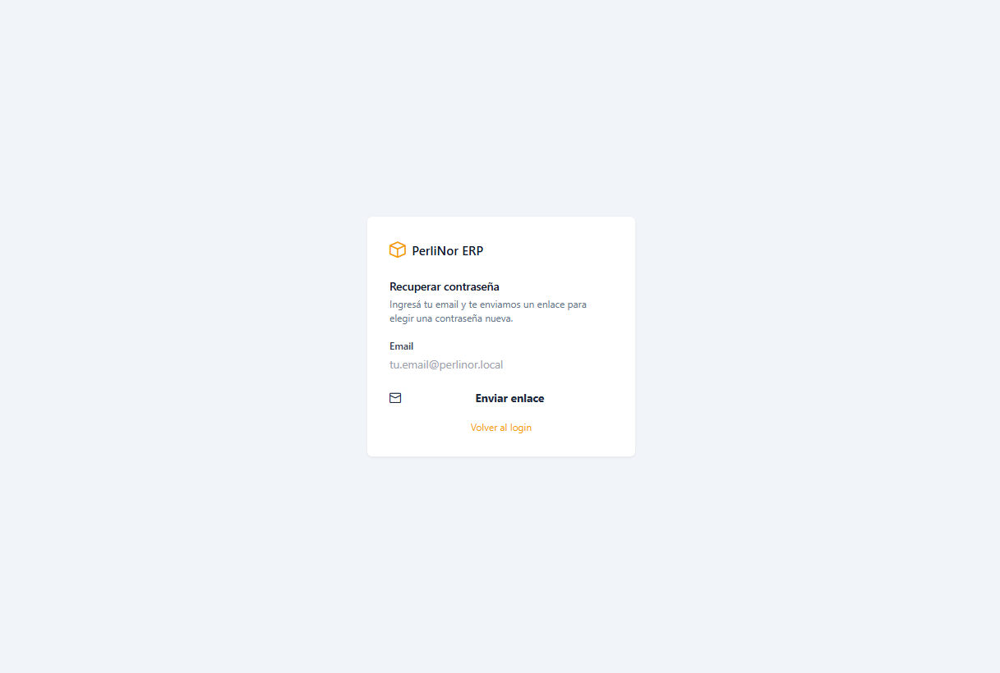
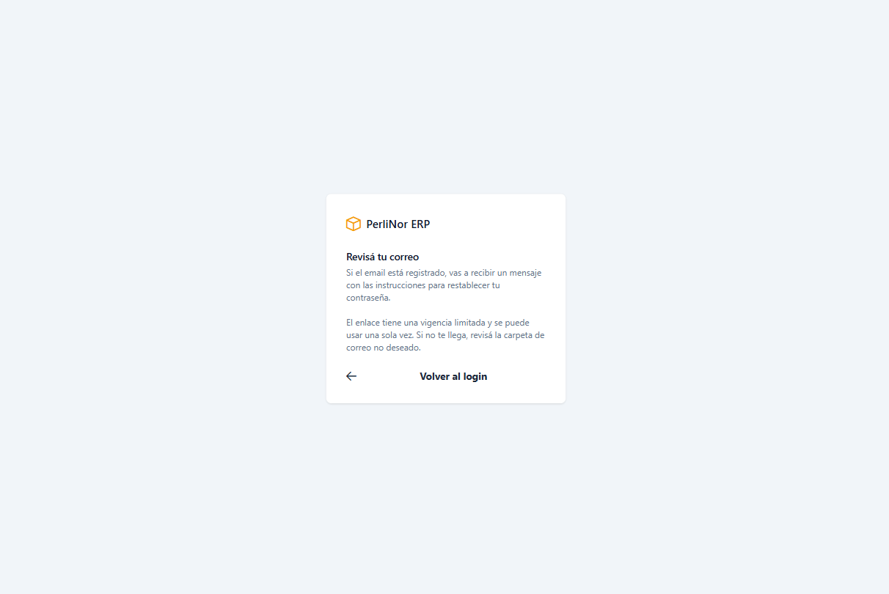
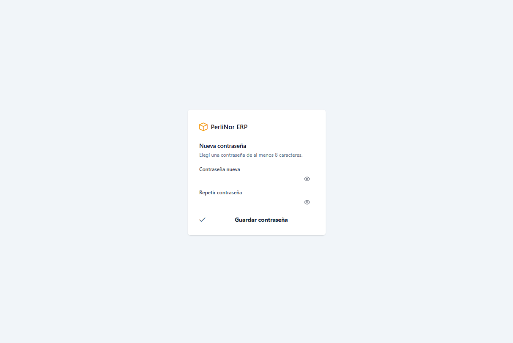
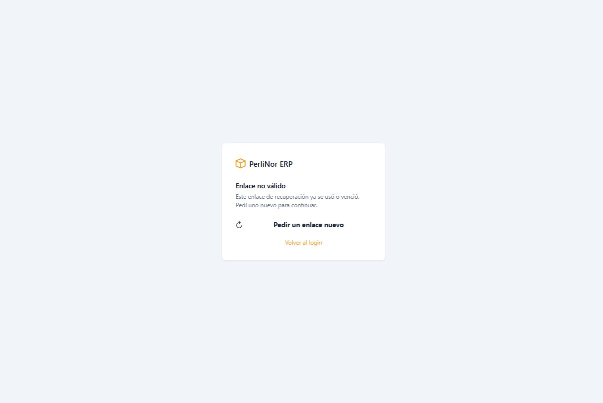

# Recuperación de contraseña

Si olvidaste tu contraseña, la podés recuperar vos mismo. No hace falta que intervenga la
administración.

El procedimiento tiene dos partes: primero pedís un enlace por correo, después elegís la contraseña
nueva.

## Parte 1 — Pedir el enlace

**Paso 1.** En la pantalla de acceso, hacé clic en **¿Olvidaste tu contraseña?**

**Paso 2.** Escribí tu email y hacé clic en **Enviar**.

<figure class="media">
  
  <figcaption>Formulario de solicitud del enlace de recuperación.</figcaption>
</figure>

**Paso 3.** Vas a ver este aviso:

<figure class="media">
  
  <figcaption>Aviso que confirma que la solicitud fue procesada.</figcaption>
</figure>

> «Si el email está registrado, vas a recibir un mensaje con las instrucciones para restablecer tu
> contraseña.»

> **Por qué dice «si el email está registrado».** El sistema muestra siempre el mismo aviso, exista o
> no la dirección que escribiste. Es una medida de seguridad: impide que alguien use esta pantalla
> para averiguar qué direcciones tienen cuenta.
>
> **No significa que haya fallado.** Si tu email es correcto, el mensaje ya salió.

**Paso 4.** Revisá tu casilla de correo. Si no lo ves en unos minutos, fijate en la carpeta de correo
no deseado.

## Parte 2 — Elegir la contraseña nueva

**Paso 5.** Abrí el mensaje y hacé clic en el enlace.

**Paso 6.** Escribí la contraseña nueva dos veces: una en **Contraseña** y otra en **Repetir
contraseña**.

<figure class="media">
  
  <figcaption>Formulario para definir la contraseña nueva.</figcaption>
</figure>

La contraseña debe tener **al menos 8 caracteres**, y las dos tienen que coincidir. Si no, el botón
no se habilita.

**Paso 7.** Hacé clic en **Guardar**. Vas a ver el aviso «Tu contraseña fue actualizada. Ya podés
iniciar sesión.»

**Paso 8.** Volvé a la pantalla de acceso e ingresá con tu contraseña nueva.

## El enlace tiene límites

<blockquote class="aviso">

<strong>Tres cosas que conviene saber sobre el enlace:</strong>

<ul>
<li><strong>Dura 30 minutos.</strong> Pasado ese tiempo deja de servir y hay que pedir uno nuevo.</li>
<li><strong>Se usa una sola vez.</strong> Una vez que cambiaste la contraseña, ese enlace ya no funciona.</li>
<li><strong>Solo vale el último.</strong> Si pediste el enlace varias veces, únicamente el más reciente sirve.</li>
</ul>
</blockquote>

Si el enlace ya venció o ya lo usaste, vas a ver esta pantalla:

<figure class="media">
  
  <figcaption>Pantalla que aparece cuando el enlace venció, ya fue usado o no es válido.</figcaption>
</figure>

No es un problema: volvé a la pantalla de acceso y pedí un enlace nuevo.

## Si hiciste muchos intentos

Si pedís el enlace muchas veces seguidas, el sistema te va a frenar con este mensaje:

> «Hiciste demasiados intentos. Esperá unos minutos y volvé a probar.»

Es una protección contra el uso automatizado. Esperá unos minutos y volvé a intentar.

## Preguntas frecuentes de este capítulo

| Duda | Respuesta |
|---|---|
| No me llegó el mensaje | Revisá correo no deseado. Verificá que el email que escribiste sea el de tu cuenta. Si no, consultá con la administración |
| Quiero cambiar la contraseña sin haberla olvidado | Usá el mismo procedimiento: **¿Olvidaste tu contraseña?** |
| ¿Alguien más puede ver mi contraseña nueva? | No. El sistema no guarda la contraseña tal como la escribís, y nadie —tampoco la administración— puede consultarla |
| Cambié la contraseña, ¿se cierran las sesiones abiertas en otros equipos? | No de inmediato. Siguen funcionando durante unos días. Si te preocupa, avisá a la administración |
