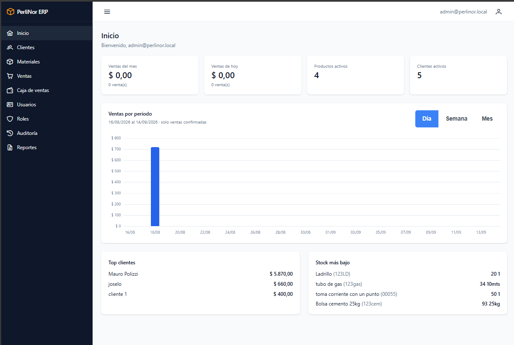
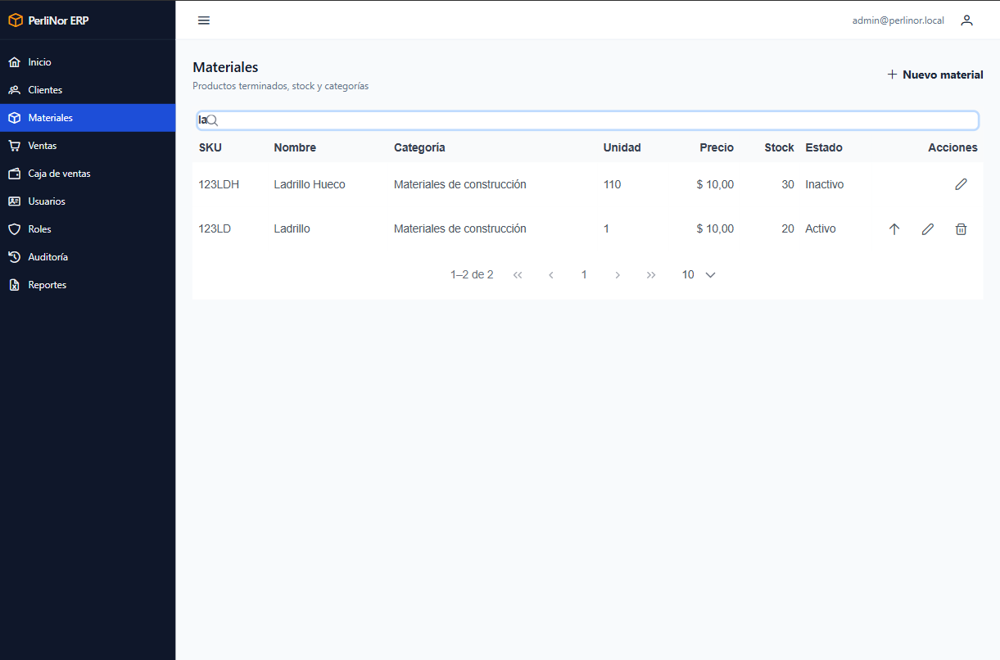
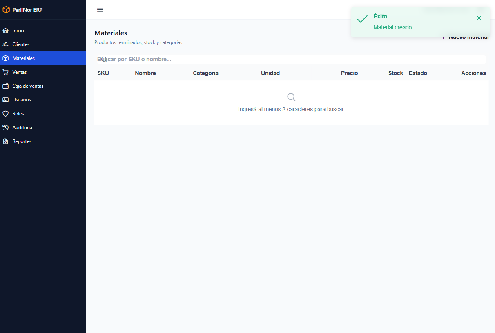
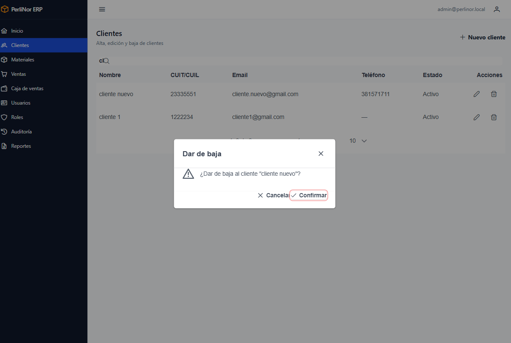

# Recorrido por la interfaz

Todas las pantallas del sistema funcionan igual. Este capítulo explica esa mecánica común una sola
vez, para no repetirla en cada módulo.

**Conviene leerlo completo**, aunque tengas experiencia con otros sistemas: hay dos comportamientos
que sorprenden la primera vez y se explican acá.

## Las zonas de la pantalla

<figure>
  

    
    <!-- Coordenadas ajustadas sobre la captura real (1223 × 821). -->
    1
    2
    3
  

  <figcaption>Zonas de la pantalla: (1) menú lateral, (2) barra superior, (3) área de contenido.</figcaption>
</figure>

**1 — Menú lateral.** Los módulos a los que tenés acceso. El que estás viendo queda resaltado. Con el
botón de la barra superior podés contraerlo para ganar espacio.

**2 — Barra superior.** A la izquierda, el botón que contrae el menú. A la derecha, tu email y el
ícono de usuario, donde está la opción **Cerrar sesión**.

**3 — Área de contenido.** La pantalla en la que estás trabajando.

## Los listados

Casi todos los módulos empiezan con un listado. Todos tienen la misma estructura.

<figure>
  

    
    <!-- Coordenadas ajustadas sobre la captura real (1221 × 806). -->
    1
    2
    3
    4
  

  <figcaption>Elementos de un listado: (1) buscador, (2) columnas, (3) acciones por fila, (4) paginador.</figcaption>
</figure>

**1 — Buscador.** Escribís y los resultados se filtran solos, sin apretar ningún botón.

**2 — Columnas.** La información de cada registro.

**3 — Acciones.** Los botones al final de cada fila: editar, dar de baja, ver detalle. Según el
módulo y tu rol, vas a ver unos u otros.

**4 — Paginador.** Si hay muchos resultados, se muestran de a páginas.

### Dos comportamientos que conviene conocer

<blockquote class="aviso">

<strong>1. En Clientes, Materiales y Usuarios el listado arranca vacío, a propósito.</strong>

Cuando entrás a uno de esos módulos no vas a ver ningún registro, sino el mensaje
«Ingresá al menos 2 caracteres para buscar.»

<strong>No es un error ni significa que no haya datos.</strong> Son catálogos que pueden tener
muchos registros, y traerlos todos no sirve de nada cuando estás buscando uno en particular.
Escribí dos letras en el buscador y los resultados aparecen.

</blockquote>

<blockquote class="aviso">

<strong>2. En Ventas, Caja de ventas y Auditoría el listado arranca mostrando el día de hoy.</strong>

Estos tres módulos sí muestran información al entrar, pero acotada al día en curso, que es lo que
se necesita en el trabajo diario.

Si buscás algo de otra fecha, <strong>ampliá el rango</strong> con los campos <strong>Desde</strong>
y <strong>Hasta</strong>. El botón <strong>Restablecer</strong> vuelve al día de hoy.

</blockquote>

## Los avisos

Cuando hacés una operación, el sistema te confirma el resultado con un aviso que aparece arriba a la
derecha y desaparece solo a los pocos segundos.

<figure class="media">
  
  <figcaption>Aviso de confirmación tras una operación exitosa.</figcaption>
</figure>

| Color | Significado |
|---|---|
| Verde | La operación se completó |
| Rojo | Algo falló. El texto explica qué |
| Azul | Información, sin que nada haya fallado |

Los avisos en rojo son los importantes: **leelos antes de que desaparezcan**. Explican por qué no se
pudo hacer lo que pediste.

## Las confirmaciones

Antes de una operación que no se puede deshacer —dar de baja algo, anular una venta—, el sistema te
pide confirmación.

<figure class="media">
  
  <figcaption>Diálogo de confirmación previo a una operación irreversible.</figcaption>
</figure>

El texto te dice **qué va a pasar**, no solo qué vas a hacer. Cuando anulás una venta, por ejemplo, te
avisa que se va a reponer el stock. Leelo antes de aceptar.

## Los formularios

**Los campos obligatorios** se marcan y no te dejan guardar si están vacíos.

**Los errores aparecen debajo del campo**, en rojo, apenas salís de él. No hace falta enviar el
formulario para enterarte.

**Mientras se guarda**, el botón se deshabilita y muestra que está trabajando. Evita que guardes dos
veces por error.

**Si algo falla al guardar**, aparece un aviso rojo y el formulario **se queda como estaba**, con todo
lo que cargaste. No perdés el trabajo: corregís lo que haga falta y volvés a intentar.

## Cómo se muestran los datos

| Dato | Formato | Ejemplo |
|---|---|---|
| Importes | Pesos, con punto de miles y coma decimal | `$ 1.234.567,89` |
| Cantidades | Coma decimal | `1.250,500` |
| Fechas | Día/mes/año | `13/09/2026` |
| Fecha y hora | Día/mes/año y hora | `13/09/2026 14:30` |
| Dato ausente | Un guion | `—` |

Un guion no es un error: significa que ese dato no se cargó o no corresponde.
