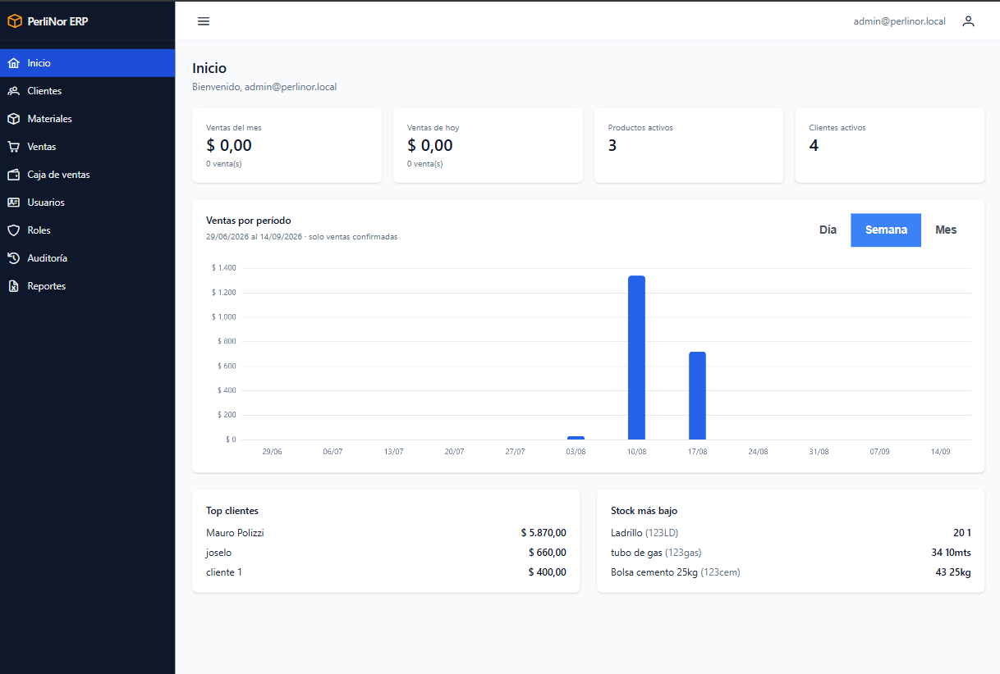
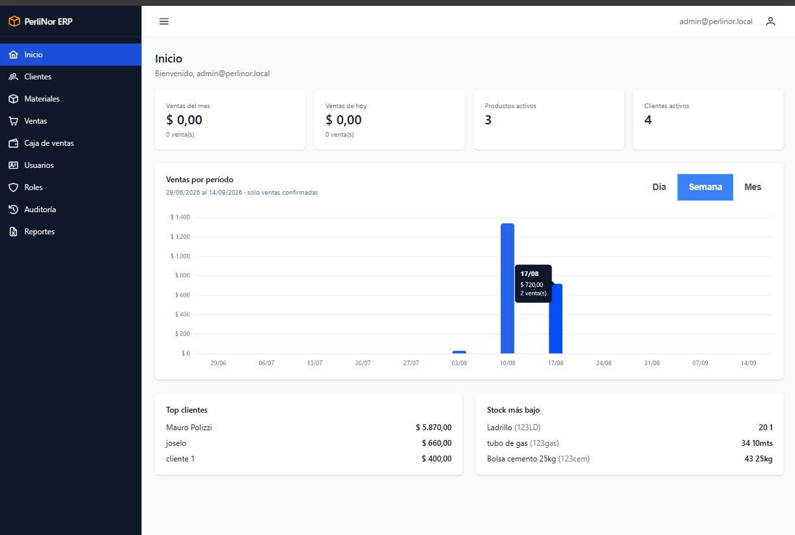

# Pantalla de inicio

Es la primera pantalla que ves al entrar. Reúne los indicadores de gestión de la fábrica.

**Todos los roles tienen acceso.**

<figure>
  
  <figcaption>Pantalla de inicio con los indicadores de gestión.</figcaption>
</figure>

## Los indicadores

### Ventas del mes

Total vendido y cantidad de ventas desde el día 1 del mes en curso hasta hoy.

### Ventas de hoy

Total vendido y cantidad de ventas del día de hoy.

### Productos activos

Cuántos materiales hay en el catálogo. No cuenta los que están dados de baja.

### Clientes activos

Cuántos clientes tenés cargados. No cuenta los dados de baja.

<blockquote class="aviso">

<strong>Las ventas anuladas no se cuentan en ningún indicador.</strong>

Si anulás una venta, los totales se ajustan: esa venta deja de figurar. Lo mismo vale para el
gráfico, la caja y los reportes. Los indicadores muestran siempre las ventas que están vigentes.

</blockquote>

## Top clientes

Los cinco clientes que más compraron, con el total acumulado de cada uno. Se calcula sobre todas las
ventas confirmadas, sin límite de fecha.

## Stock más bajo

Los cinco materiales con **menos stock** del catálogo, con su cantidad disponible.

> **Atención con este panel.** Muestra los cinco materiales con menor stock, comparados entre sí. **No
> son materiales por debajo de un mínimo configurado**: el sistema no maneja un stock mínimo por
> material.
>
> Si tu catálogo está bien abastecido, igual vas a ver cinco materiales acá. Son los que tienen menos,
> no necesariamente los que faltan.

## Ventas por período

El gráfico muestra cómo vienen las ventas a lo largo del tiempo.

<figure>
  
  <figcaption>Panel <em>Ventas por período</em>. Al apoyar el puntero sobre una barra se muestra el importe y la cantidad de ventas de ese intervalo.</figcaption>
</figure>

### Cambiar el período

Arriba del gráfico hay tres botones:

| Botón | Qué muestra |
|---|---|
| **Día** | Los últimos 30 días, una barra por día |
| **Semana** | Las últimas 12 semanas, una barra por semana |
| **Mes** | Los últimos 12 meses, una barra por mes |

Al cambiar de período, solo se recarga el gráfico. Los demás indicadores quedan como están.

### Cómo leerlo

**Apoyá el puntero sobre una barra** para ver el total vendido y la cantidad de ventas de ese período.

**Las barras en cero también aparecen.** Si un día no hubo ventas, vas a ver el espacio vacío. Es
intencional: si se omitieran, el gráfico uniría dos días con ventas y parecería que hubo actividad
continua cuando no la hubo.

Si no hubo ninguna venta en todo el período, el gráfico muestra «Sin ventas confirmadas en el
período.» en lugar de barras planas.

## Qué hacer con esta información

| Si ves… | Puede significar… |
|---|---|
| Ventas de hoy en cero, avanzada la jornada | Hay ventas sin registrar |
| Un material con stock muy bajo en el panel | Conviene reponerlo antes de que se agote y bloquee una venta |
| El gráfico con una caída sostenida | Vale la pena revisar el período en el listado de Ventas o descargar el reporte |
| Un cliente que subió al panel de principales | Puede justificar una condición comercial distinta |
