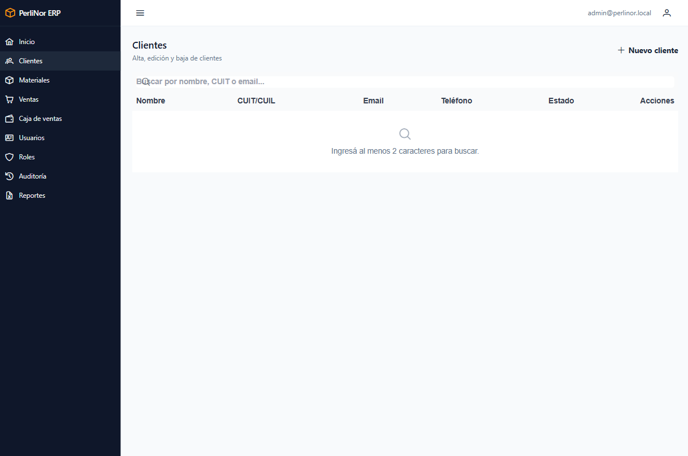
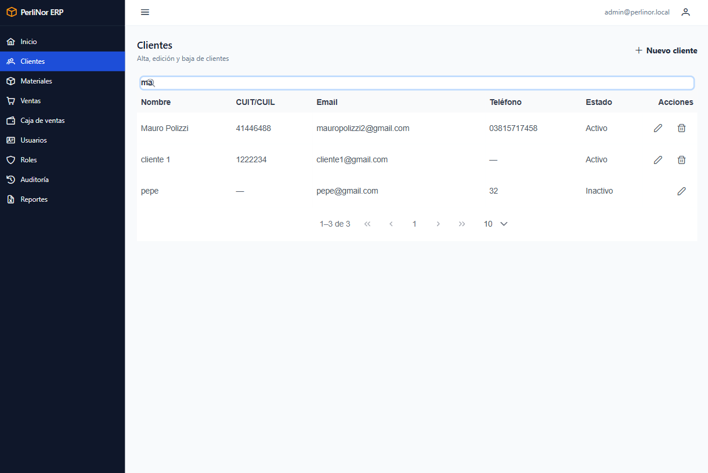
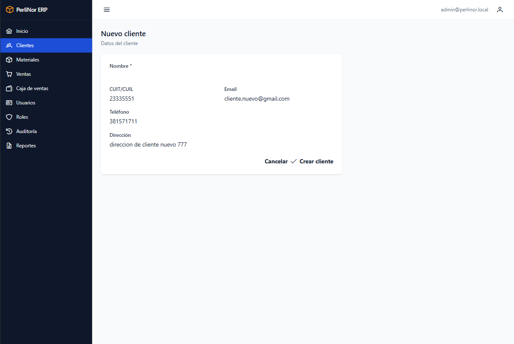
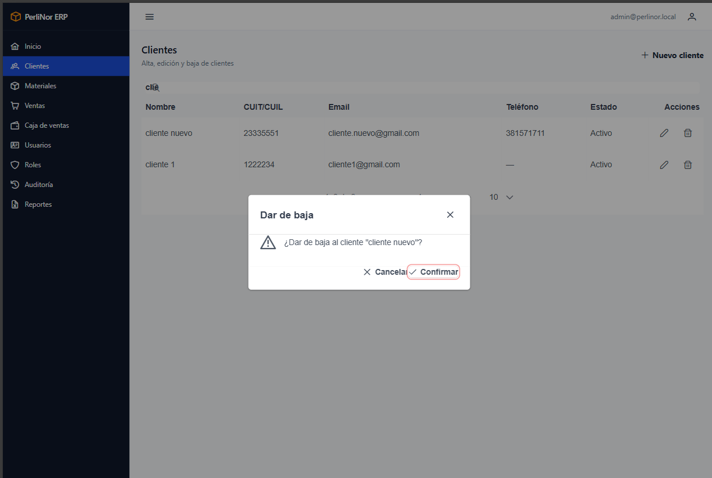

# Clientes

Acá se administra el padrón de clientes de la fábrica. Todo cliente al que le vendas tiene que estar
cargado.

**Acceden:** Administración y Ventas. Finanzas puede consultarlo.

## Buscar un cliente

El listado **arranca vacío a propósito**: escribí al menos dos letras en el buscador para ver
resultados.

<figure>
  
  <figcaption>Estado inicial del listado de Clientes. El mensaje indica que hay que buscar para ver resultados.</figcaption>
</figure>

Podés buscar por **nombre, CUIT o email**, y no hace falta escribir el dato completo: con una parte
alcanza. Tampoco importan las mayúsculas.

<figure>
  
  <figcaption>Listado de Clientes con resultados de una búsqueda.</figcaption>
</figure>

## Dar de alta un cliente

**Paso 1.** Hacé clic en **Nuevo cliente**.

**Paso 2.** Completá los datos.

<figure class="media">
  
  <figcaption>Formulario de alta de cliente.</figcaption>
</figure>

| Campo | ¿Obligatorio? | Detalle |
|---|---|---|
| **Nombre** | **Sí** | Razón social o nombre. Mínimo 2 caracteres |
| CUIT / Documento | No | |
| Email | No | Si lo cargás, tiene que ser una dirección válida |
| Teléfono | No | |
| Dirección | No | |

**Paso 3.** Hacé clic en **Guardar**. Vas a ver el aviso «Cliente creado.»

> **Solo el nombre es obligatorio.** Podés dar de alta un cliente con el nombre nada más y completar
> el resto después. Conviene cargar el CUIT desde el principio, porque es el dato que aparece en el
> reporte de ventas.

> **El sistema no controla CUIT repetidos.** Si cargás dos veces el mismo cliente con distinto
> nombre, se van a crear dos fichas. Buscá antes de dar de alta.

## Modificar un cliente

**Paso 1.** Buscalo en el listado.

**Paso 2.** Hacé clic en el botón de editar de su fila.

**Paso 3.** Modificá lo que necesites y hacé clic en **Guardar**. Vas a ver «Cliente actualizado.»

Podés modificar todos los campos, incluido el nombre. **Las ventas ya registradas no se alteran**:
siguen apuntando a la misma ficha.

## Dar de baja un cliente

Se usa cuando un cliente deja de operar con la fábrica.

**Paso 1.** Buscalo en el listado.

**Paso 2.** Hacé clic en el botón de baja de su fila.

**Paso 3.** Confirmá en el diálogo.

<figure class="media">
  
  <figcaption>Confirmación previa a dar de baja un cliente.</figcaption>
</figure>

Vas a ver el aviso «Cliente dado de baja.»

<blockquote class="aviso">

<strong>Dar de baja no borra nada.</strong>

El cliente se desactiva, pero su ficha y todas sus ventas se conservan. El historial queda
intacto y los reportes de períodos anteriores siguen siendo correctos.

Lo único que cambia es que <strong>ya no vas a poder registrarle ventas nuevas</strong> ni te va a
aparecer en el selector de clientes al cargar una venta.

</blockquote>

Si diste de baja un cliente por error, comunicate con la administración: la reactivación no se hace
desde esta pantalla.

## Mensajes que podés ver

| Mensaje | Qué significa |
|---|---|
| «Cliente creado.» | El alta se completó |
| «Cliente actualizado.» | Los cambios se guardaron |
| «Cliente dado de baja.» | El cliente quedó desactivado |
| «No se encontraron clientes para esa búsqueda.» | No hay coincidencias. Probá con menos letras o con otro dato |
| «Ingresá al menos 2 caracteres para buscar.» | Estado inicial del listado. Escribí en el buscador |

## Preguntas frecuentes de este capítulo

| Duda | Respuesta |
|---|---|
| Cargué mal el nombre de un cliente | Editalo. El cambio se refleja en todas sus ventas, que siguen siendo la misma operación |
| Un cliente no aparece al cargar una venta | Puede estar dado de baja. Buscalo en el listado para verificarlo |
| ¿Puedo eliminar un cliente definitivamente? | No. El sistema no borra datos, para no perder el historial de ventas |
