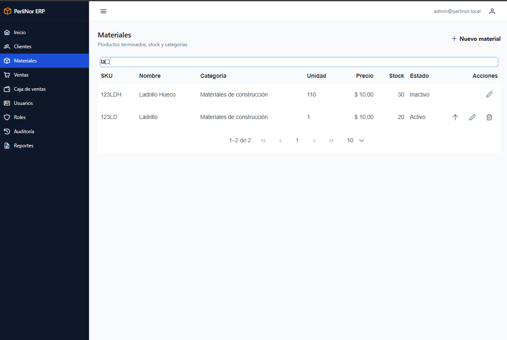
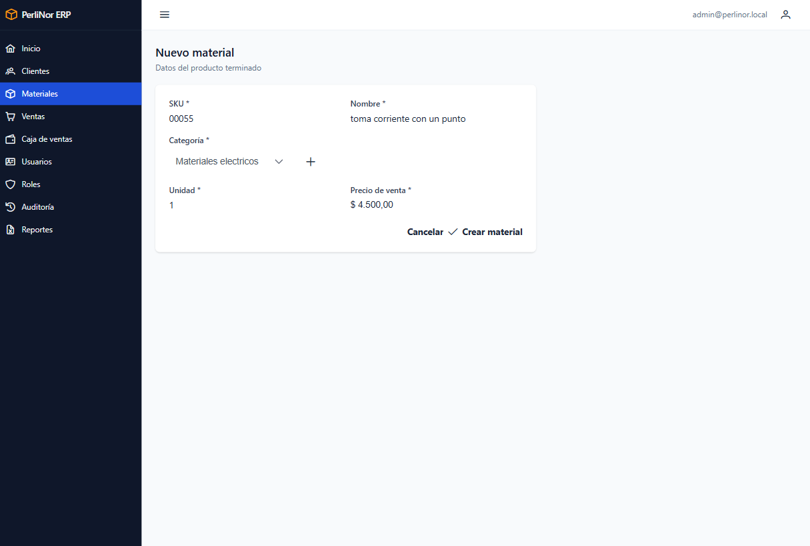
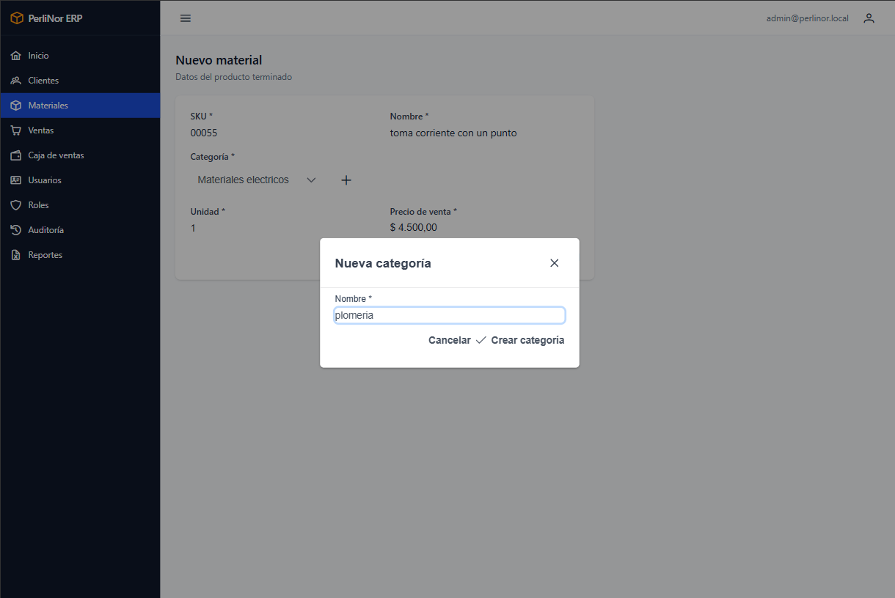
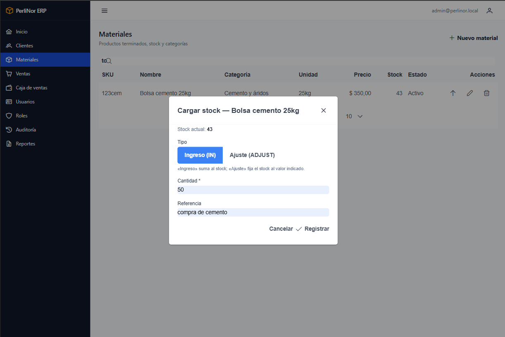
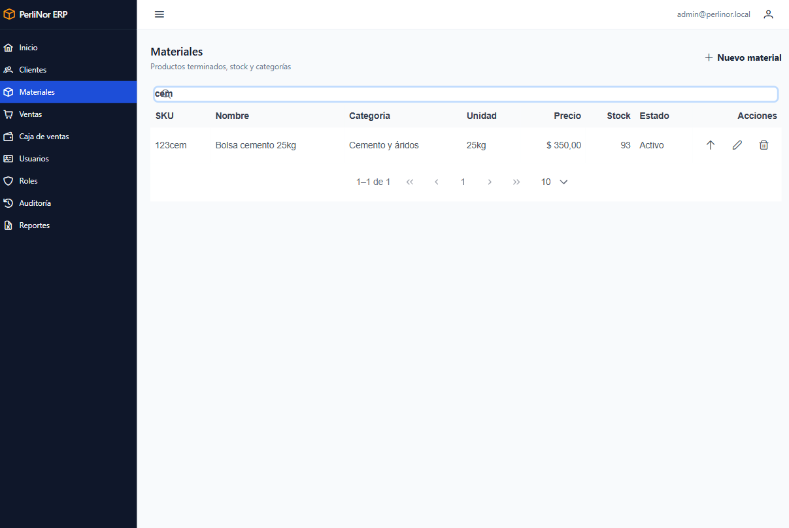

# Materiales y stock

Acá se administra el catálogo de materiales que la fábrica vende, con su precio y su stock.

**Acceden:** Administración, Stock y Producción. Ventas y Finanzas pueden consultarlo.

## Buscar un material

El listado **arranca vacío a propósito**: escribí al menos dos letras para ver resultados. Podés
buscar por **SKU o por nombre**.

<figure>
  
  <figcaption>Listado de Materiales. Las columnas Precio y Stock muestran los datos que más se consultan.</figcaption>
</figure>

| Columna | Qué muestra |
|---|---|
| **SKU** | Código del material. Es único |
| **Nombre** | Denominación |
| **Categoría** | Clasificación |
| **Unidad** | Cómo se cuenta: unidad, bolsa, m³ |
| **Precio** | Precio de venta vigente |
| **Stock** | Cantidad disponible |
| **Estado** | Activo o Inactivo |

## Dar de alta un material

**Paso 1.** Hacé clic en **Nuevo material**.

**Paso 2.** Completá los datos.

<figure class="media">
  
  <figcaption>Formulario de alta de material.</figcaption>
</figure>

| Campo | ¿Obligatorio? | Detalle |
|---|---|---|
| **SKU** | **Sí** | Código único. No puede repetirse |
| **Nombre** | **Sí** | Mínimo 2 caracteres |
| **Categoría** | **Sí** | Se elige de la lista. Si falta, la podés crear acá mismo |
| **Unidad** | **Sí** | Unidad de medida: `u`, `bolsa`, `m3` |
| **Precio** | **Sí** | Precio de venta. Puede ser 0 y corregirse después |

**Paso 3.** Hacé clic en **Guardar**. Vas a ver «Material creado.»

<blockquote class="aviso">

<strong>El material nace con stock 0.</strong>

El formulario de alta no tiene campo de stock, y es a propósito: el stock <strong>solo</strong> se
modifica con movimientos, para que siempre quede registrado de dónde salió cada cambio.

Después de dar de alta el material, cargale el stock inicial con un <strong>Ingreso</strong>
(más abajo en este capítulo).

</blockquote>

### Crear una categoría sin salir del formulario

Si la categoría que necesitás no está en la lista, hacé clic en el botón de agregar que está al lado
del selector.

<figure class="media">
  
  <figcaption>Diálogo de alta rápida de categoría, sobre el formulario de material.</figcaption>
</figure>

Escribí el nombre y hacé clic en **Guardar**. La categoría queda creada y **seleccionada** en el
formulario. No perdés lo que ya habías cargado.

## Modificar un material

**Paso 1.** Buscalo y hacé clic en el botón de editar.

**Paso 2.** Modificá lo que necesites y guardá. Vas a ver «Material actualizado.»

Podés cambiar el SKU, el nombre, la categoría, la unidad y el precio. **No podés cambiar el stock
desde acá.**

<blockquote class="aviso">

<strong>Cambiar el precio no altera las ventas ya registradas.</strong>

Cada venta guarda el precio que el material tenía <strong>en el momento de registrarse</strong>.
Si hoy actualizás la lista de precios, las ventas de ayer conservan el precio de ayer.

Es lo que permite que los reportes de meses cerrados den siempre el mismo resultado.

</blockquote>

## Registrar un movimiento de stock

Es el procedimiento con el que entra mercadería al sistema, y también con el que se corrigen
diferencias.

**Paso 1.** Buscá el material y hacé clic en el botón de stock de su fila.

**Paso 2.** Elegí el tipo de movimiento: **Ingreso** o **Ajuste**.

<figure class="media">
  
  <figcaption>Diálogo de movimiento de stock. El selector define si la cantidad se suma o reemplaza el stock actual.</figcaption>
</figure>

**Paso 3.** Escribí la cantidad.

**Paso 4.** Opcionalmente, completá **Referencia** con el motivo: «Recepción de producción»,
«Recuento del 13/09», el número de remito.

**Paso 5.** Hacé clic en **Guardar**. Vas a ver «Movimiento de stock registrado.»

<figure>
  
  <figcaption>El listado refleja el stock actualizado inmediatamente después del movimiento.</figcaption>
</figure>

### Ingreso y Ajuste no son lo mismo

<blockquote class="aviso">

<strong>Esta es la distinción más importante del capítulo. Leela con atención.</strong>

<table>
<tr><th>Tipo</th><th>Qué hace</th><th>Cuándo se usa</th></tr>
<tr><td><strong>Ingreso</strong></td><td><strong>SUMA</strong> la cantidad al stock actual</td><td>Entró mercadería</td></tr>
<tr><td><strong>Ajuste</strong></td><td><strong>REEMPLAZA</strong> el stock por la cantidad indicada</td><td>Corrección tras un recuento físico</td></tr>
</table>

<strong>Ejemplo.</strong> Un material tiene <strong>200 unidades</strong> y cargás la cantidad
<strong>50</strong>:

<ul>
<li>Con <strong>Ingreso</strong>, el stock pasa a <strong>250</strong>. (200 + 50)</li>
<li>Con <strong>Ajuste</strong>, el stock pasa a <strong>50</strong>. (queda en 50)</li>
</ul>

Elegir mal el tipo modifica el inventario sin que nada avise. Si te equivocaste, corregilo con un
<strong>Ajuste</strong> al valor correcto y dejá el motivo en la Referencia.

</blockquote>

### Las salidas no se cargan a mano

En el diálogo no hay opción de salida, y es intencional: **el stock baja únicamente cuando se registra
una venta**.

Así se garantiza que toda salida de mercadería tenga una venta detrás. Si necesitás descontar stock
por rotura o pérdida, usá un **Ajuste** al valor real y aclaralo en la Referencia.

## Dar de baja un material

Se usa cuando un material deja de fabricarse o venderse.

**Paso 1.** Buscalo y hacé clic en el botón de baja.

**Paso 2.** Confirmá. Vas a ver «Material dado de baja.»

Igual que con los clientes, **el material no se borra**: se desactiva. Su historial de movimientos y
las ventas donde figura se conservan. Deja de aparecer al cargar una venta.

## Mensajes que podés ver

| Mensaje | Qué significa | Qué hacer |
|---|---|---|
| «Material creado.» | El alta se completó | — |
| «Material actualizado.» | Los cambios se guardaron | — |
| «Movimiento de stock registrado.» | El stock se actualizó | Verificá el valor en la columna Stock |
| «Material dado de baja.» | Quedó desactivado | — |
| «El SKU ya fue registrado» | Ese código ya lo tiene otro material | Buscá el SKU en el listado: puede que el material ya exista |
| «La categoría indicada no existe» | La categoría fue dada de baja | Elegí otra o creá una nueva |
| «No se encontraron materiales para esa búsqueda.» | Sin coincidencias | Probá con menos letras o con el nombre en vez del SKU |

## Preguntas frecuentes de este capítulo

| Duda | Respuesta |
|---|---|
| Di de alta el material pero el stock quedó en 0 | Es lo esperado. Cargale el stock inicial con un **Ingreso** |
| Me equivoqué de tipo de movimiento | Corregí con un **Ajuste** al valor correcto y dejá el motivo en la Referencia |
| Necesito descontar stock por rotura | Usá un **Ajuste** al valor real. Las salidas por venta las genera el sistema |
| El material no aparece al cargar una venta | Puede estar dado de baja, o tener stock 0 |
| ¿Puedo ver el historial de movimientos? | Sí, el sistema lo conserva. Consultá con la administración cómo acceder |
