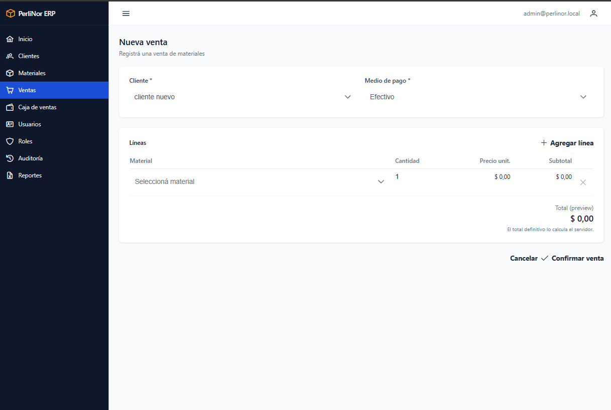
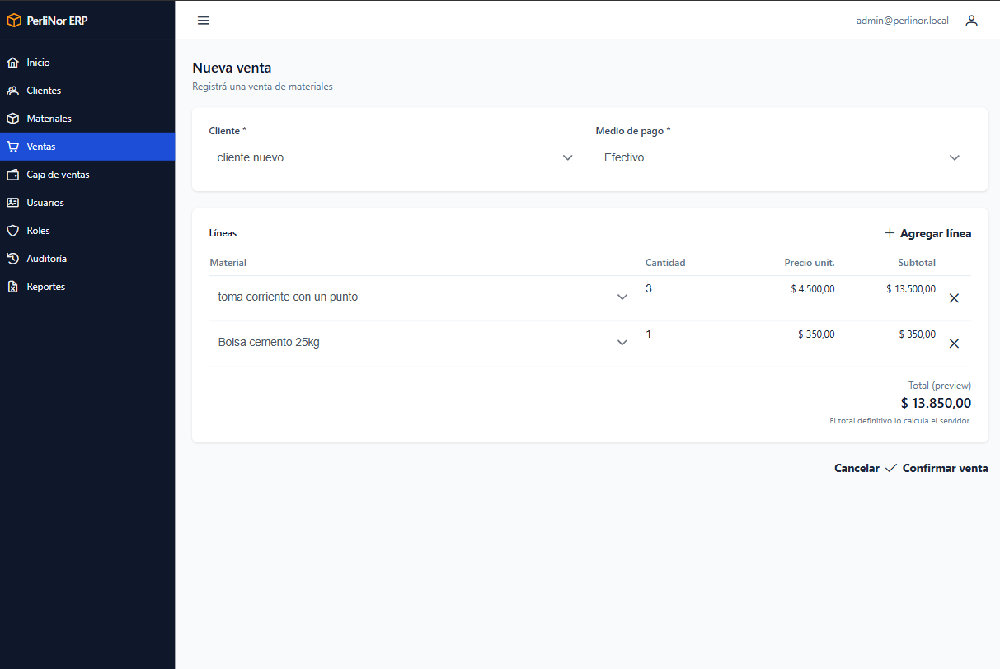
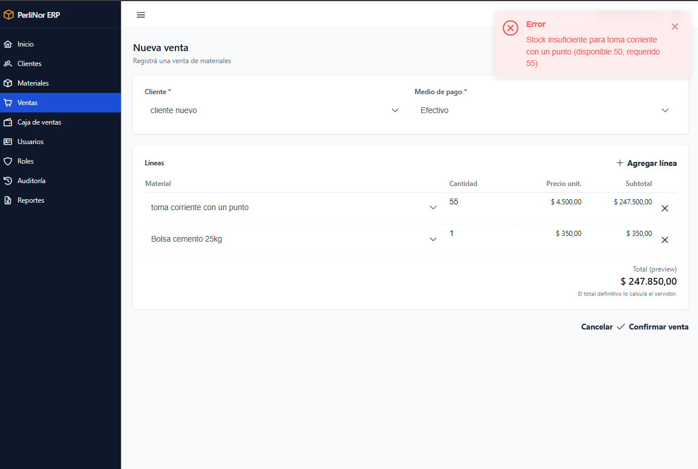
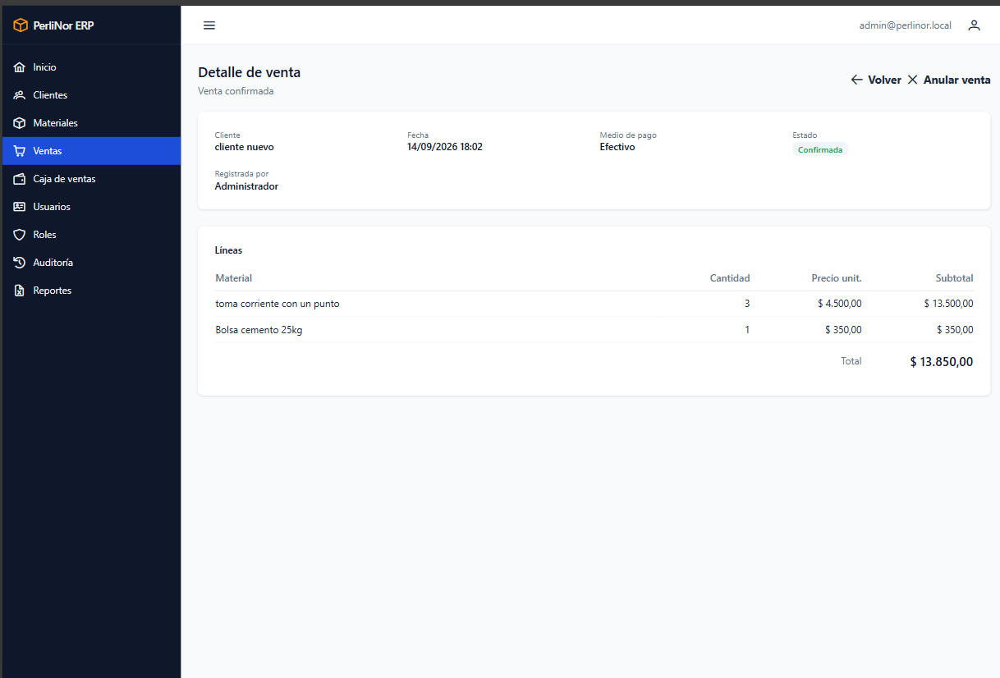
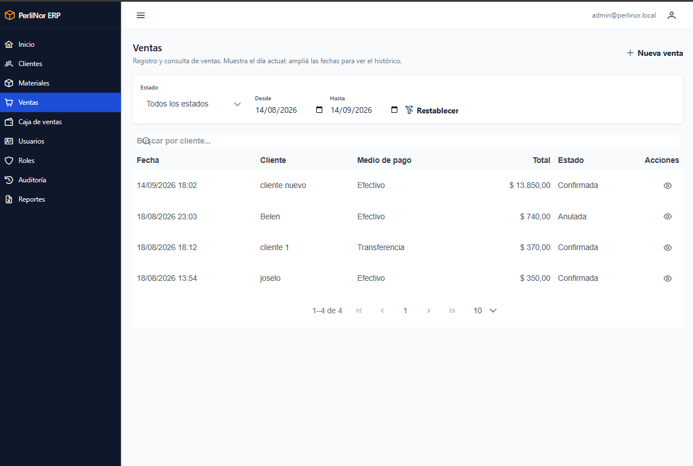
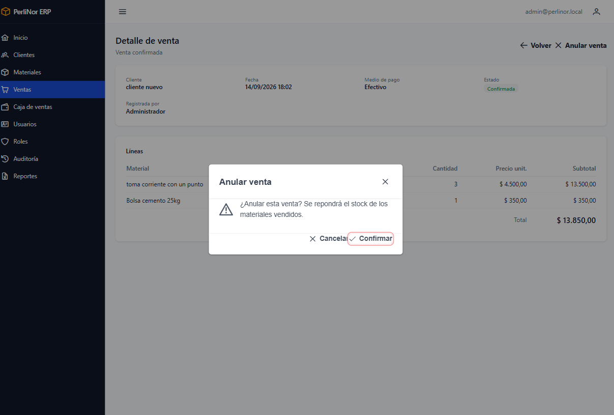
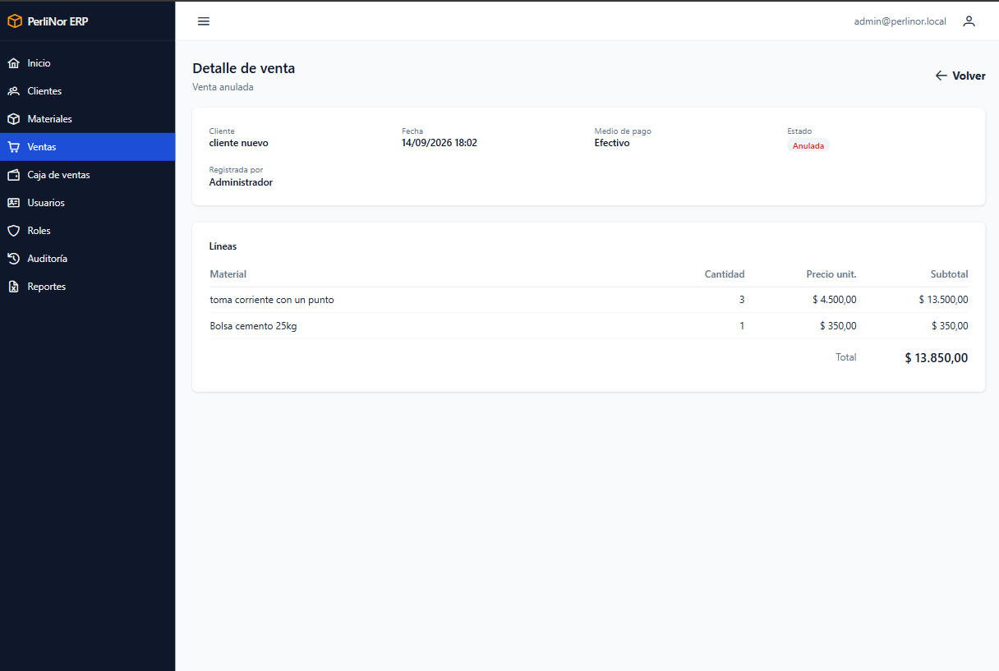

# Ventas

Es el módulo central del sistema. Acá se registran las ventas, se consultan y, si hace falta, se
anulan.

**Acceden:** Administración y Ventas. Finanzas puede consultarlo.

## Antes de registrar una venta

Necesitás que ya existan:

- El **cliente**, dado de alta y activo (capítulo 6).
- Los **materiales**, dados de alta y **con stock suficiente** (capítulo 7).

Si falta alguno, cargalo primero.

## Registrar una venta

**Paso 1.** En el menú, entrá a **Ventas** y hacé clic en **Nueva venta**.

<figure>
  
  <figcaption>Formulario de registro de venta, al abrirse.</figcaption>
</figure>

**Paso 2.** Elegí el **cliente** de la lista. Aparecen solamente los clientes activos.

**Paso 3.** Elegí el **medio de pago**: Efectivo, Transferencia, Tarjeta, Cheque o Cuenta corriente.

**Paso 4.** Cargá la primera línea: elegí el **material** y escribí la **cantidad**.

El precio unitario y el total de la línea **se calculan solos**, con el precio que el material tiene
cargado. No se escriben a mano.

**Paso 5.** Si la venta tiene más de un material, hacé clic en **Agregar línea** y repetí. Con el
botón de quitar sacás una línea que cargaste de más.

<figure>
  
  <figcaption>Formulario con dos líneas cargadas. El subtotal y el total se actualizan a medida que se agregan materiales.</figcaption>
</figure>

**Paso 6.** Revisá el **total** al pie.

**Paso 7.** Hacé clic en **Registrar**.

Si todo está bien, el sistema te lleva directo al **detalle de la venta**, ya confirmada.

### Qué hace el sistema al registrar

En un solo paso, y de forma indivisible:

1. Confirma la venta con su detalle.
2. **Descuenta el stock** de cada material vendido.
3. **Registra el ingreso en la caja de ventas.**
4. Deja constancia de quién la registró.

<blockquote class="aviso">

<strong>O se hace todo, o no se hace nada.</strong>

Si algo falla —por ejemplo, no alcanza el stock—, <strong>la venta no se registra y el stock queda
exactamente como estaba</strong>. Nunca vas a tener una venta a medias, ni stock descontado sin venta.

</blockquote>

### El precio queda congelado

El precio que se guarda en la venta es el que el material tenía **en ese momento**. Si mañana cambia
la lista de precios, esta venta conserva el precio de hoy.

## Si no alcanza el stock

Es el error más frecuente del módulo.

<figure>
  
  <figcaption>Aviso de stock insuficiente. Indica el material, la cantidad disponible y la requerida.</figcaption>
</figure>

> «Stock insuficiente para *Vigueta pretensada 3,00 m* (disponible 8, requerido 20)»

**Qué pasó:** pediste más de lo que hay. El aviso te dice el material, cuánto hay y cuánto pediste.

**Qué NO pasó:** la venta no se registró y **el stock no se tocó**. El formulario queda como estaba,
con todo lo que cargaste.

**Qué hacer**, según el caso:

| Situación | Qué hacer |
|---|---|
| Te equivocaste en la cantidad | Corregila y volvé a intentar |
| Hay mercadería que no se cargó al sistema | Andá a **Materiales**, registrá el **Ingreso**, y volvé |
| Realmente no hay stock | Sacá esa línea o reducí la cantidad a lo disponible |

> **Si cargaste el mismo material en dos líneas**, el sistema suma las dos cantidades para verificar
> el stock. Dos líneas de 60 unidades necesitan 120 disponibles, no 60.

## Otros errores al registrar

| Mensaje | Qué significa | Qué hacer |
|---|---|---|
| «La venta debe tener al menos un ítem» | No cargaste ninguna línea | Agregá al menos un material con su cantidad |
| «El cliente no existe o está inactivo» | El cliente fue dado de baja mientras cargabas | Elegí otro cliente o pedí que lo reactiven |
| «Producto inexistente o inactivo» | Un material fue dado de baja mientras cargabas | Sacá esa línea y elegí otro material |
| «No hay una caja de ventas configurada.» | Falta una configuración del sistema | Avisá a la administración. No es un problema de la venta |

## Ver el detalle de una venta

En el listado, hacé clic en la fila.

<figure>
  
  <figcaption>Detalle de una venta confirmada, con su cabecera y sus líneas.</figcaption>
</figure>

Vas a ver el cliente, la fecha y hora, el medio de pago, el vendedor, el estado, cada línea con su
cantidad y precio, y los totales.

Si el vendedor aparece como «—», la venta se registró antes de que el sistema guardara ese dato.

## Consultar ventas

<figure>
  
  <figcaption>Listado de Ventas con sus filtros: rango de fechas, estado y buscador por cliente.</figcaption>
</figure>

El listado **arranca mostrando las ventas de hoy**.

| Filtro | Para qué sirve |
|---|---|
| **Desde** / **Hasta** | Rango de fechas. Ampliá para ver otros períodos |
| **Estado** | Todas, Confirmadas o Anuladas |
| **Buscador** | Busca por nombre de cliente. Con una parte del nombre alcanza |
| **Restablecer** | Vuelve al día de hoy, sin filtro de estado |

Las ventas se muestran de la más reciente a la más antigua.

> **Si no encontrás una venta**, lo más probable es que sea de otra fecha. Ampliá el rango con
> **Desde** y **Hasta**.

## Anular una venta

Se usa cuando una venta se registró por error.

**Paso 1.** Abrí el detalle de la venta.

**Paso 2.** Hacé clic en **Anular**.

**Paso 3.** Leé la confirmación y aceptá.

<figure class="media">
  
  <figcaption>Confirmación previa a anular una venta.</figcaption>
</figure>

Vas a ver el aviso «Venta anulada. Stock repuesto.»

<figure>
  
  <figcaption>Detalle de una venta anulada. El estado cambió y el botón Anular ya no está disponible.</figcaption>
</figure>

### Qué hace el sistema al anular

1. Marca la venta como **Anulada**.
2. **Repone el stock** de todos los materiales vendidos.
3. **Revierte el ingreso en la caja**, con un movimiento negativo.

<blockquote class="aviso">

<strong>La anulación no se puede deshacer.</strong>

Una venta anulada queda anulada. Si la operación era correcta, hay que <strong>registrarla de
nuevo</strong>.

La venta anulada no se borra: queda en el listado con estado Anulada, para que el historial
muestre lo que pasó.

</blockquote>

### Qué deja de contar una venta anulada

A partir de la anulación, esa venta **no se computa** en:

- Los indicadores de la pantalla de inicio.
- El gráfico de evolución de ventas.
- El saldo de la caja de ventas.
- El reporte de ventas por período.

Sigue apareciendo en el listado de Ventas, con su estado, y en la Auditoría.

### Si no podés anular

| Mensaje | Qué significa |
|---|---|
| «Solo se pueden anular ventas confirmadas» | La venta ya estaba anulada |
| «La venta ya no está confirmada» | Otra persona la anuló al mismo tiempo. Recargá la pantalla |

## Preguntas frecuentes de este capítulo

| Duda | Respuesta |
|---|---|
| ¿Puedo modificar una venta registrada? | No. Si tiene un error, anulala y registrala de nuevo |
| ¿Puedo cambiarle el precio a una línea? | No. El precio sale del material. Si está mal, corregilo en **Materiales** y registrá la venta de nuevo |
| Registré dos veces la misma venta | Anulá una de las dos. El stock se repone solo |
| ¿La venta a Cuenta corriente suma a la caja? | Sí. Todas las ventas registran su ingreso, cualquiera sea el medio de pago |
| No encuentro una venta de la semana pasada | Ampliá el rango de fechas: el listado arranca en el día de hoy |
| ¿Puedo dejar una venta a medio cargar y seguir después? | No. La venta se registra completa o no se registra |
