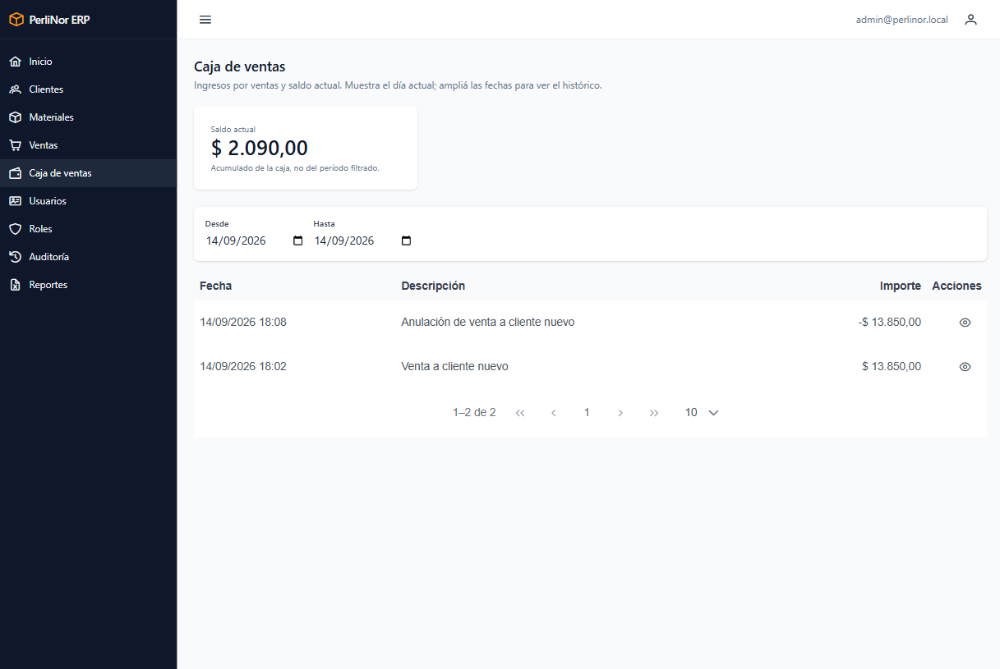

# Caja de ventas

Muestra el dinero que ingresó por las ventas de la fábrica.

**Acceden:** Administración y Finanzas.

## La caja se alimenta sola

<blockquote class="aviso">

<strong>Acá no se cargan movimientos.</strong>

Todos los movimientos los genera el sistema:

<ul>
<li>Cada <strong>venta registrada</strong> genera un ingreso por su importe total.</li>
<li>Cada <strong>venta anulada</strong> genera un movimiento negativo que revierte el ingreso.</li>
</ul>

Esta pantalla es de consulta: no tiene botones de alta ni de edición.

</blockquote>

## Qué vas a ver

<figure>
  
  <figcaption>Caja de ventas: el saldo acumulado arriba y el listado de movimientos del día debajo.</figcaption>
</figure>

**Arriba, el saldo.** El total acumulado de la caja.

**Abajo, los movimientos**, con fecha y hora, descripción e importe. El listado **arranca mostrando
los del día de hoy**.

## El saldo no cambia con el filtro

<blockquote class="aviso">

<strong>Esto es lo que más confunde de esta pantalla, así que conviene tenerlo claro.</strong>

El <strong>saldo</strong> de arriba es el <strong>acumulado total de la caja</strong>, desde
siempre. <strong>No cambia</strong> cuando filtrás por fecha.

El filtro afecta <strong>solamente al listado</strong> de abajo.

Es decir: si filtrás una semana en la que hubo $500.000 de ventas, el listado va a mostrar esos
movimientos, pero el saldo va a seguir mostrando el acumulado completo. <strong>No es un error.</strong>

</blockquote>

## Filtrar los movimientos

| Filtro | Para qué sirve |
|---|---|
| **Desde** / **Hasta** | Acota el listado a un rango de fechas |
| **Restablecer** | Vuelve a los movimientos del día de hoy |

Si no hay movimientos en el rango elegido, vas a ver «No hubo movimientos de caja en el período
seleccionado.»

## Cómo leer los movimientos

| Importe | Qué significa |
|---|---|
| **Positivo** | Ingreso por una venta |
| **Negativo** | Reversión por una venta anulada |

<figure>
  
  <figcaption>Movimiento negativo generado por la anulación de una venta.</figcaption>
</figure>

La descripción te dice de qué se trata: «Venta a *cliente*» para los ingresos, «Anulación de venta a
*cliente*» para las reversiones.

> **Las anulaciones dejan dos movimientos, no cero.** Cuando se anula una venta, el ingreso original
> **se conserva** y se agrega uno negativo por el mismo importe. La suma de los dos es cero, pero
> ambos quedan a la vista.
>
> Es a propósito: así el historial muestra que hubo una venta y que después se anuló. Si el ingreso
> se borrara, esa operación desaparecería del registro sin dejar rastro.

## Ir a la venta de un movimiento

Los movimientos que vienen de una venta te permiten abrirla: hacé clic en el movimiento y el sistema
te lleva a su detalle. Sirve para saber qué se vendió, a quién y quién la registró.

## Preguntas frecuentes de este capítulo

| Duda | Respuesta |
|---|---|
| El saldo no coincide con la suma de lo que veo | El saldo es el acumulado total; el listado está filtrado por fecha. Es lo esperado |
| ¿Puedo cargar un movimiento a mano? | No. Los genera el sistema con cada venta y cada anulación |
| ¿Puedo corregir un movimiento? | No directamente. Si la venta estaba mal, anulala: la caja se ajusta sola |
| Una venta en cuenta corriente aparece como ingreso | Sí. El sistema registra todas las ventas en la caja, cualquiera sea el medio de pago |
| ¿Esta caja incluye los pagos a proveedores? | No. Solo refleja ingresos por ventas y sus reversiones |
