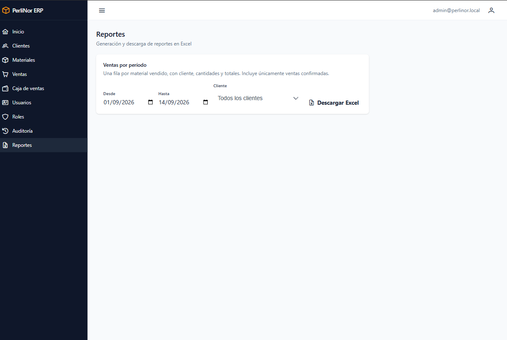
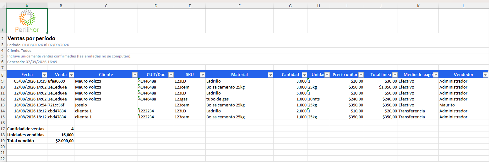

# Reportes

Permite descargar la información de ventas en un archivo de planilla de cálculo, para analizarla
fuera del sistema.

**Acceden:** Administración y Finanzas.

## Qué necesitás saber antes

Para aprovechar el reporte conviene manejar lo básico de una planilla de cálculo: abrir un archivo,
ordenar y filtrar columnas. Si sabés usar tablas dinámicas, mejor: el reporte está pensado para eso.

## Descargar el reporte de ventas

**Paso 1.** En el menú, entrá a **Reportes**.

<figure>
  
  <figcaption>Pantalla de Reportes. El período viene precargado con el mes en curso.</figcaption>
</figure>

**Paso 2.** Revisá el **período**. Viene precargado desde el día 1 del mes hasta hoy. Cambialo si
necesitás otro rango.

**Paso 3.** Si querés el reporte de un cliente puntual, elegilo en **Cliente**. Si lo dejás en «Todos
los clientes», salen todas las ventas del período.

**Paso 4.** Hacé clic en **Descargar**.

El archivo se descarga como cualquier archivo del navegador. Vas a ver un aviso con la cantidad de
líneas: «Reporte generado con 184 línea(s) de venta.»

## Qué contiene el archivo

<figure>
  
  <figcaption>Reporte generado, abierto en una planilla de cálculo: encabezado con el período aplicado, tabla con filtro automático y bloque de totales al pie.</figcaption>
</figure>

**Arriba**, el logo, el título y las líneas de contexto: el período, el cliente filtrado, la
aclaración de que solo incluye ventas confirmadas, y la fecha y hora de generación.

**En el medio**, la tabla:

| Columna | Qué muestra |
|---|---|
| Fecha | Fecha y hora de la venta |
| Venta | Identificador abreviado |
| Cliente | Nombre del cliente |
| CUIT/Doc | Identificación tributaria |
| SKU | Código del material |
| Material | Nombre del material |
| Cantidad | Unidades vendidas en esa línea |
| Unidad | Unidad de medida |
| Precio unitario | Precio al momento de la venta |
| Total línea | Importe de la línea |
| Medio de pago | En español |
| Vendedor | Quién registró la venta |

**Abajo**, los totales: cantidad de ventas, unidades vendidas y total vendido.

## Una fila por línea, no por venta

<blockquote class="aviso">

<strong>Cada fila es una línea de venta, no una venta.</strong>

Una venta con tres materiales distintos ocupa <strong>tres filas</strong>, que repiten el cliente,
la fecha y el número de venta.

Por eso <strong>«Cantidad de ventas» no coincide con la cantidad de filas</strong>: cuenta ventas
distintas, no líneas.

Es a propósito. Con este nivel de detalle podés armar el corte que necesites —por cliente, por
material, por mes, por vendedor— con una tabla dinámica, sin pedir un reporte nuevo.

</blockquote>

## Solo ventas confirmadas

El reporte **no incluye las ventas anuladas**. El encabezado del archivo lo aclara, para que quien lo
reciba no tenga que suponerlo.

Es el mismo criterio de los indicadores y de la caja: una venta anulada devolvió el stock y revirtió
el dinero, así que no corresponde computarla.

## La planilla viene lista para trabajar

**El encabezado queda fijo**: al bajar por la tabla, los títulos de columna siguen visibles.

**Las columnas tienen filtro automático**: podés ordenar y filtrar desde los títulos.

**Los números son números**, no texto. Se pueden sumar y usar en tablas dinámicas sin conversiones.

## Mensajes que podés ver

| Mensaje | Qué significa | Qué hacer |
|---|---|---|
| «Reporte generado con N línea(s) de venta.» | La descarga se completó | Abrí el archivo |
| «No hay ventas confirmadas en el período. El archivo se descargó sin datos.» | No hubo ventas en ese rango | El archivo se descarga igual, con encabezado y sin filas. Ampliá el período |
| «El reporte supera las 20.000 filas. Achicá el rango de fechas.» | El período es demasiado amplio | Reducí el rango, o filtrá por un cliente |
| «La fecha "desde" no puede ser posterior a "hasta".» | El rango está invertido | Corregí las fechas |

## Preguntas frecuentes de este capítulo

| Duda | Respuesta |
|---|---|
| ¿Puedo exportar a PDF? | No. El único formato es planilla de cálculo |
| ¿El reporte incluye las ventas anuladas? | No |
| ¿Por qué hay más filas que ventas? | Cada fila es una línea de venta. Una venta con varios materiales ocupa varias filas |
| Necesito el total por cliente | Descargá el reporte y armá una tabla dinámica agrupando por Cliente |
| ¿Puedo pedir otro reporte? | Hoy hay uno solo. El sistema está preparado para incorporar otros |
| ¿Dónde quedó el archivo? | En la carpeta de descargas de tu navegador |
