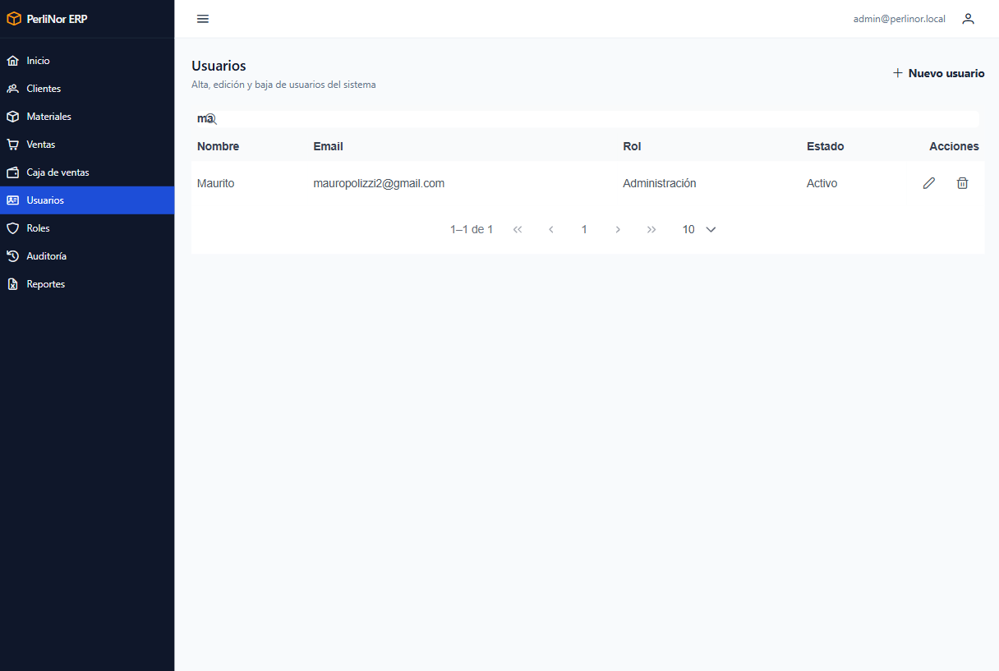
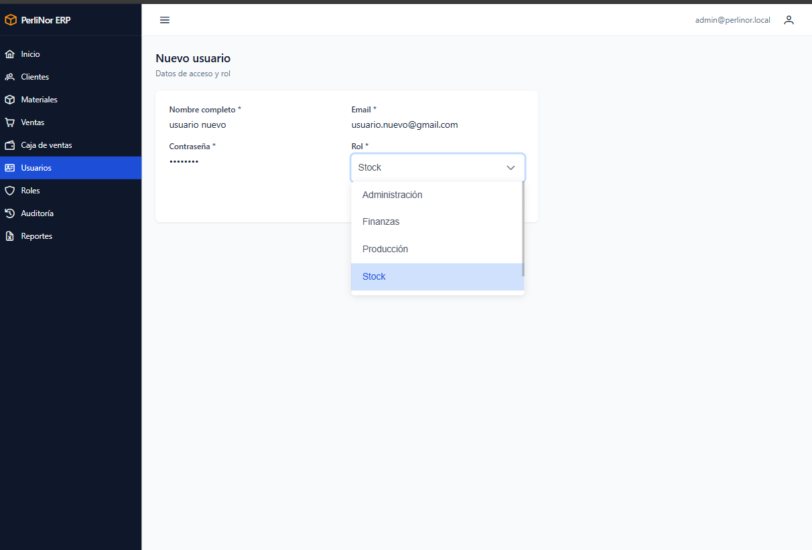
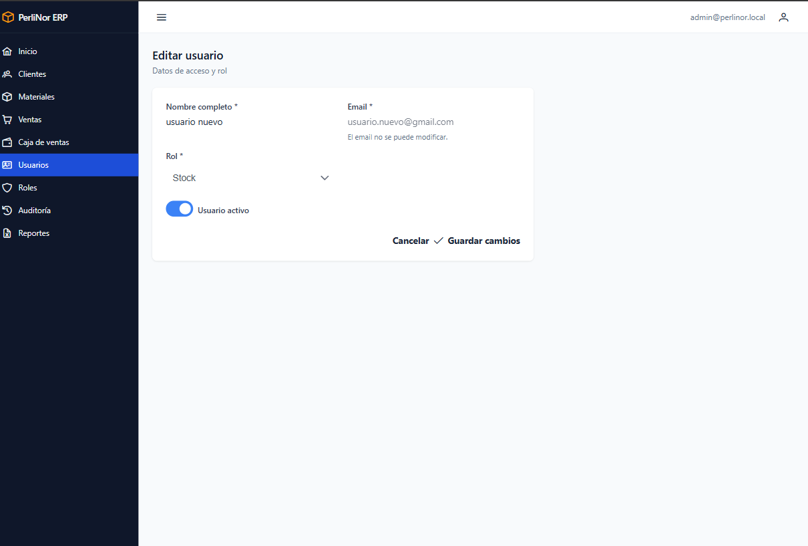
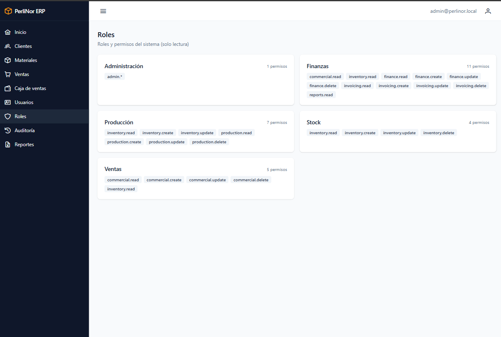
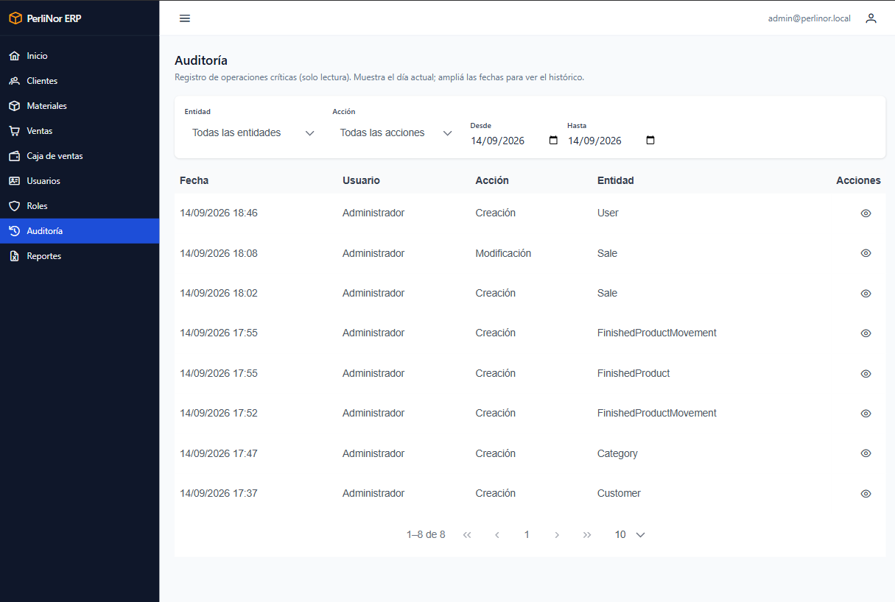
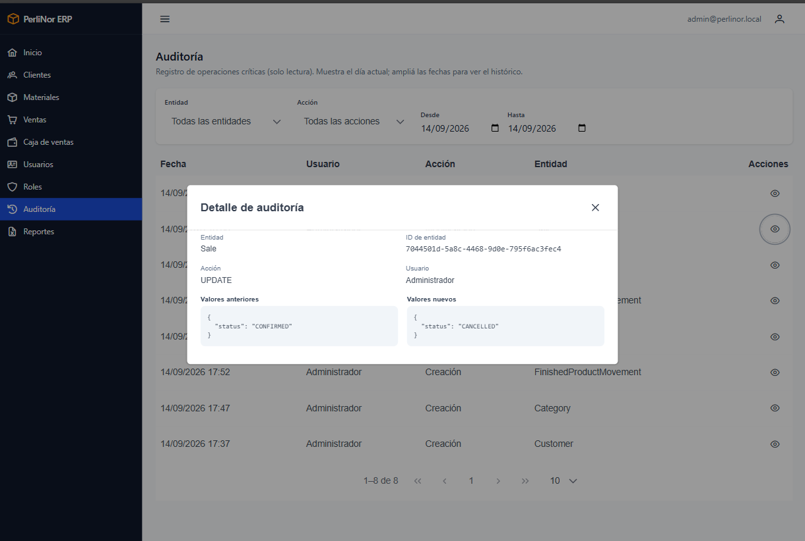

# Administración: usuarios, roles y auditoría

Los tres módulos de este capítulo son exclusivos del rol **Administración**.

## Usuarios

Acá se administran las cuentas de acceso al sistema.

> **Usuario no es lo mismo que empleado.** Un usuario es una cuenta para entrar al sistema. La
> fábrica tiene más empleados que usuarios: solo tienen cuenta quienes necesitan operar el sistema.

### Buscar un usuario

El listado **arranca vacío**: escribí al menos dos letras. Podés buscar por **nombre o email**.

<figure>
  
  <figcaption>Listado de Usuarios con resultados de una búsqueda.</figcaption>
</figure>

### Dar de alta un usuario

**Paso 1.** Hacé clic en **Nuevo usuario**.

**Paso 2.** Completá los datos.

<figure class="media">
  
  <figcaption>Formulario de alta de usuario, con el selector de rol desplegado.</figcaption>
</figure>

| Campo | ¿Obligatorio? | Detalle |
|---|---|---|
| **Nombre completo** | **Sí** | Nombre que se muestra en el sistema |
| **Email** | **Sí** | Con el que va a entrar. No puede repetirse |
| **Contraseña** | **Sí** | Mínimo 8 caracteres |
| **Rol** | **Sí** | Define qué va a poder hacer |

**Paso 3.** Guardá. Vas a ver «Usuario creado.»

**Paso 4.** Entregale al usuario su email y su contraseña, y pedile que la cambie en el primer
ingreso (capítulo 3).

<blockquote class="aviso">

<strong>El rol define todo lo que la persona puede hacer.</strong>

Elegilo con cuidado: determina qué módulos ve en el menú y qué operaciones puede realizar.
El alcance de cada rol está en el capítulo 1.

</blockquote>

### Modificar un usuario

<figure class="media">
  
  <figcaption>Formulario de edición. El email aparece en gris porque no se puede modificar.</figcaption>
</figure>

Podés cambiar el **nombre** y el **rol**.

**El email no se puede modificar.** Aparece en gris, deshabilitado. Si alguien necesita otro email,
hay que dar de alta una cuenta nueva y dar de baja la anterior.

**La contraseña no se cambia desde acá.** Ni siquiera Administración puede verla o modificarla: cada
persona la cambia con el procedimiento del capítulo 3.

### Dar de baja un usuario

**Paso 1.** Buscalo y hacé clic en el botón de baja.

**Paso 2.** Confirmá. Vas a ver «Usuario dado de baja.»

A partir de ese momento **no puede entrar al sistema**. Todo lo que hizo se conserva: las ventas que
registró siguen mostrando su nombre, y sus operaciones siguen en la auditoría.

### Mensajes que podés ver

| Mensaje | Qué significa |
|---|---|
| «Usuario creado.» · «Usuario actualizado.» · «Usuario dado de baja.» | La operación se completó |
| «El email ya está registrado» | Ya existe una cuenta con ese email, activa o dada de baja |

## Roles

Es una pantalla de **consulta**: muestra los cinco roles y qué permisos tiene cada uno.

<figure>
  
  <figcaption>Pantalla de Roles: cada rol con la lista de permisos que agrupa.</figcaption>
</figure>

> **Los roles no se modifican desde el sistema.** Están definidos y no se pueden editar, ni crear
> roles nuevos. Lo que sí podés hacer es **cambiarle el rol a un usuario** desde el módulo de
> Usuarios.

Los permisos se nombran con el formato `módulo.acción`. Por ejemplo, `commercial.create` significa
«puede crear en el módulo comercial».

Algunos roles tienen permisos de módulos que todavía no están disponibles, como Producción. Están
previstos para cuando esos módulos se incorporen.

## Auditoría

Registra **quién hizo qué y cuándo** en las operaciones importantes del sistema.

<figure>
  
  <figcaption>Listado de Auditoría con sus filtros: entidad, acción y rango de fechas.</figcaption>
</figure>

El listado **arranca mostrando el día de hoy**.

### Filtros

| Filtro | Para qué sirve |
|---|---|
| **Entidad** | Sobre qué se operó: Venta, Cliente, Material, Usuario |
| **Acción** | Creación, Modificación o Baja |
| **Desde** / **Hasta** | Rango de fechas |

### Ver el detalle

Hacé clic en una fila para ver qué cambió exactamente.

<figure>
  
  <figcaption>Detalle de un registro de auditoría, con los valores anterior y posterior.</figcaption>
</figure>

El detalle muestra el **valor anterior** y el **valor posterior**. En una creación solo hay valor
posterior; en una baja, solo anterior.

> Los valores se muestran en el formato técnico en que el sistema los guarda. No es el más cómodo de
> leer, pero permite ver con precisión qué campo cambió y de qué a qué.

### Para qué sirve

| Situación | Cómo ayuda |
|---|---|
| Un precio cambió y nadie sabe quién | Filtrá por entidad Material y acción Modificación |
| Un cliente aparece dado de baja | Filtrá por entidad Cliente y acción Baja |
| Hay que reconstruir qué pasó un día | Poné el rango en esa fecha y mirá todo el movimiento |

### Qué se registra y qué no

**Se registra:** creación, modificación y baja de clientes, materiales, usuarios, categorías, ventas
y movimientos de stock. También los cambios de contraseña, sin guardar la contraseña.

**No se registra:** las consultas. Que alguien vea un listado o descargue un reporte no deja
registro.

## Preguntas frecuentes de este capítulo

| Duda | Respuesta |
|---|---|
| Necesito cambiarle el email a un usuario | No se puede. Creá una cuenta nueva y dá de baja la anterior |
| Un usuario olvidó su contraseña | Que use **¿Olvidaste tu contraseña?** en la pantalla de acceso. Vos no podés cambiársela |
| Necesito un rol con otros permisos | Los roles son fijos. Elegí el más parecido, o consultá por una modificación del sistema |
| Di de baja un usuario por error | Editalo y volvé a marcarlo como activo |
| ¿Se puede borrar un registro de auditoría? | No. La auditoría es de solo lectura |
