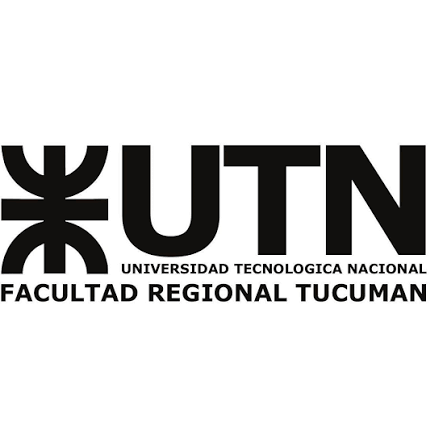

Universidad Tecnológica Nacional

Facultad Regional Tucumán

Informe de Práctica Profesional Supervisada

PerliNor ERP

Sistema de gestión comercial y de inventario para una fábrica de materiales para la construcción

Documentación técnica

Autor: Mauro Esteban Polizzi

Carrera: Tecnicatura Universitaria en Programación

Asignatura: Práctica Profesional Supervisada

Empresa: PerliNor

Tucumán, 26 de septiembre de 2026

