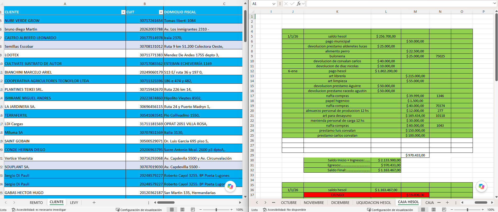

# Introducción y contexto del proyecto

Este informe documenta el diseño, la implementación y la verificación de **PerliNor ERP**, un
sistema de gestión desarrollado para PerliNor en el marco de la Práctica Profesional Supervisada de
la Tecnicatura Universitaria en Programación.

El capítulo sitúa el trabajo: describe la organización destinataria, el problema que originó el
encargo, el objetivo del sistema y —con particular precisión— el alcance efectivamente entregado y
el que quedó fuera.

## Contexto de la organización

PerliNor es una fábrica de materiales para la construcción del sector industrial. Su actividad
consiste en la elaboración y venta de materiales de obra: elementos de mampostería, premoldeados y
productos derivados del cemento y los áridos.

La empresa cuenta con **diez empleados**, distribuidos en cinco áreas funcionales: Administración,
Ventas, Producción, Stock y Finanzas. Esa división del trabajo resultó determinante para el diseño
del sistema: las cinco áreas se corresponden con los cinco **roles** que estructuran el control de
acceso, tal como se detalla en el Capítulo VI.

Conviene distinguir desde el comienzo dos conceptos que el informe utiliza con sentidos distintos.
Un **empleado** es una persona que trabaja en la empresa; un **usuario** es una cuenta de acceso al
sistema. No toda persona de la organización dispone de una cuenta: el sistema fue dimensionado para
cinco usuarios, uno por área.

## Situación previa y problema detectado

Antes de este desarrollo, la operación diaria de PerliNor se sostenía sobre documentación en papel
y planillas de cálculo elaboradas de manera independiente por cada área. La Fig. 1 muestra un
fragmento de esos registros.

<!-- FIGURA PENDIENTE (bloque B1)
     Fuente: PerliNor-ERP/Documentacion/Trabajo actual Perlinor/
     Capturar un fragmento de PERLINOR 2026.xls o DATOS CLIENTES PERLINOR.xlsm.
     ANONIMIZAR razones sociales y CUIT reales antes de capturar (riesgo R-21).
     Guardar como docs/img/fig01-planillas-actuales.png -->

<figure>
  
  <figcaption>Fragmento de los registros en planilla de cálculo utilizados por la empresa antes de la implementación. Los datos identificatorios fueron anonimizados.</figcaption>
</figure>

El problema no residía en la falta de información, sino en su **dispersión**. La convivencia de
documentos en papel con archivos que se copian, se renombran y circulan por separado producía
tres consecuencias observables:

- **Desorden operativo.** La misma información —el precio de un material, los datos de un
  cliente, la existencia disponible— se encontraba registrada en más de un lugar, sin que ninguno
  fuera reconocible como la versión válida.
- **Esfuerzo administrativo creciente.** Mantener los registros al día exigía tareas manuales de
  transcripción y cotejo que no aportaban valor y consumían tiempo de las cinco áreas.
- **Dificultad para decidir.** Responder preguntas elementales de gestión —cuánto se vendió este
  mes, qué materiales están por agotarse, quiénes son los principales clientes— requería consolidar
  manualmente varias planillas, de modo que la información llegaba tarde o directamente no se
  consultaba.

Esta última consecuencia es la más relevante, porque explica el sentido del encargo: el objetivo no
era solamente ordenar el registro, sino **volver utilizable la información que la empresa ya
producía**.

Varias decisiones de diseño que este informe desarrolla más adelante responden directamente a este
diagnóstico, y conviene leerlas a la luz de él: la validación de datos en dos capas (Capítulo III),
el control de acceso por rol (Capítulo VI), el registro de auditoría (Capítulo VII), la
integridad transaccional de las operaciones (Capítulo VIII) y el panel de indicadores de gestión
(Capítulo X).

## Objetivo del sistema

PerliNor ERP tiene por objetivo **centralizar el registro de la operación comercial y de inventario
de la empresa en un único sistema web, garantizando la consistencia de los datos y poniendo la
información de gestión a disposición de cada área según su responsabilidad**.

De ese objetivo general se desprenden cuatro objetivos específicos, que el sistema cumple y este
informe verifica:

1. **Unificar el registro.** Una única fuente de datos para materiales, existencias, clientes,
   ventas y movimientos de caja.
2. **Asegurar la consistencia.** Que toda operación que afecte las existencias o la caja las
   modifique de forma completa o no las modifique en absoluto, incluso ante operaciones simultáneas.
3. **Controlar el acceso.** Que cada usuario opere únicamente sobre las funciones que le
   corresponden según su área.
4. **Dar visibilidad.** Que la información de gestión resulte accesible sin tareas manuales de
   consolidación, tanto en pantalla como en archivos exportables.

## Alcance

El sistema se construyó de manera incremental. El alcance entregado responde a una definición
explícita del cliente: **la prioridad principal era contar con el módulo de ventas**. En
consecuencia, el desarrollo cubrió en profundidad el circuito comercial completo, y las áreas
restantes quedaron para etapas posteriores.

Esta delimitación no es una restricción sobrevenida sino una decisión de proyecto, y el informe la
documenta como tal.

### Alcance incluido

El sistema entregado implementa el siguiente circuito operativo, de extremo a extremo:

| Área | Funcionalidad entregada |
|---|---|
| Acceso | Inicio de sesión, renovación automática de la sesión y recuperación de contraseña por correo electrónico |
| Administración | Gestión de usuarios, asignación de roles y consulta del esquema de permisos |
| Inventario | Gestión del catálogo de materiales y de sus categorías; registro de ingresos y ajustes de existencias con su historial |
| Comercial | Gestión de clientes; registro de ventas con múltiples líneas, consulta con filtros, detalle y anulación |
| Finanzas | Consulta de la caja de ventas: saldo acumulado y movimientos |
| Información de gestión | Panel de inicio con indicadores, gráfico de evolución de ventas y reporte de ventas por período exportable a planilla de cálculo |
| Trazabilidad | Registro de auditoría de las operaciones críticas, con consulta filtrable y detalle de los valores modificados |

El circuito central —**alta de cliente, alta de material, carga de existencias, registro de venta,
impacto en caja y consulta del resultado**— funciona de forma completa y verificada. El Capítulo
VIII lo desarrolla en detalle y el Capítulo XII documenta las pruebas que lo respaldan.

### Alcance excluido

Las siguientes áreas **no forman parte del sistema entregado**. Se enumeran aquí de manera
explícita para delimitar con precisión lo que el informe documenta:

- Gestión de materias primas y su costo promedio ponderado.
- Registro de producción y consumo de materias primas.
- Gestión de proveedores y pagos a proveedores.
- Emisión de comprobantes fiscales y factura electrónica.

El modelo de datos fue diseñado desde el inicio previendo estas áreas, de modo que su
incorporación futura no requiera rediseñar la base. El Capítulo V distingue con claridad las
entidades implementadas de aquellas que el modelo prevé sin implementación, y el Capítulo XIV
retoma el tema como trabajo futuro.

Cabe señalar, por completitud, que durante la etapa de fundaciones se implementó también un módulo
de gestión de empleados a nivel de servicios, que no cuenta con interfaz de usuario y no integra el
alcance entregado al cliente.

### Consideraciones de alcance adicionales

Dos definiciones funcionales acordadas con el cliente conviene anticiparlas aquí, porque afectan la
lectura de los capítulos siguientes:

- **Las ventas no discriminan impuestos.** El importe total de una venta coincide con la suma de
  sus líneas. Se trata de una simplificación deliberada, adoptada para validar el circuito
  comercial sin la complejidad del tratamiento impositivo. El modelo conserva el campo
  correspondiente, de modo que la incorporación del IVA no exige modificar la estructura de datos.
- **Toda venta registra su ingreso en la caja de ventas**, cualquiera sea el medio de pago
  utilizado, incluidos cheque y cuenta corriente. Así lo especificó el cliente.

## Roles y usuarios

El sistema define cinco roles, uno por cada área funcional de la empresa. Cada rol agrupa un
conjunto de permisos que determinan tanto las funciones accesibles como las opciones visibles en el
menú de navegación.

| Rol | Alcance funcional |
|---|---|
| Administración | Acceso completo al sistema, incluidas la gestión de usuarios y la auditoría |
| Ventas | Gestión de clientes y de ventas; consulta del catálogo de materiales |
| Stock | Gestión completa del catálogo de materiales y de las existencias |
| Producción | Consulta y carga de existencias de materiales |
| Finanzas | Consulta comercial y de inventario, caja de ventas y reportes |

El Capítulo VI detalla el mecanismo de autorización que implementa este esquema y el Anexo B
presenta la matriz completa de roles y permisos.

## Organización del informe

El informe se estructura en catorce capítulos. Los Capítulos II y III describen el proceso de
trabajo y los requerimientos. Los Capítulos IV a XI constituyen el núcleo técnico: arquitectura,
modelo de datos, seguridad, implementación del servidor y del cliente, y la interfaz de
programación. Dentro de ese bloque, el **Capítulo VIII** desarrolla el registro y la anulación de
ventas, que concentra la mayor complejidad técnica de la solución. Los Capítulos XII a XIV cubren la
verificación, la puesta en marcha y las limitaciones conocidas.

El vocabulario empleado a lo largo del informe se define en el glosario del Anexo A. Se recomienda
su consulta previa: varios conceptos del dominio reciben en la interfaz un nombre distinto del que
utiliza el código, y el glosario fija la equivalencia.
