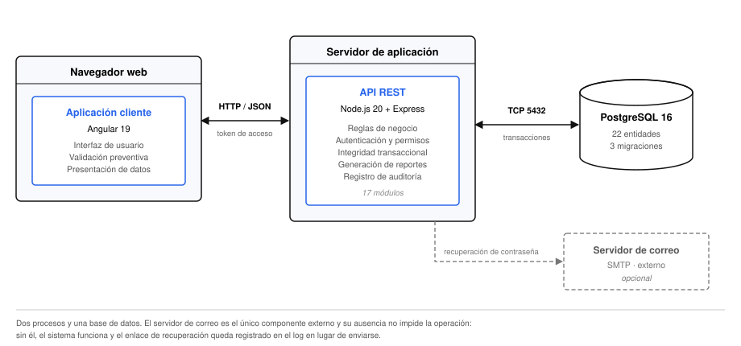

# Arquitectura del sistema

Este capítulo describe la estructura del sistema: cómo se divide, qué responsabilidad tiene cada
parte, cómo se comunican entre sí y por qué se adoptó cada decisión estructural.

## Visión general

PerliNor ERP se organiza como un **monolito modular distribuido en dos procesos**: una aplicación
de página única que se ejecuta en el navegador y un servidor de interfaz de programación que
concentra la lógica de negocio y el acceso a los datos. Ambos se comunican exclusivamente mediante
peticiones HTTP con cuerpos en formato JSON, contra una única base de datos relacional.

<figure>
  
  <figcaption>Arquitectura general. El navegador ejecuta la aplicación cliente, que consume la interfaz de programación del servidor; este accede a la base de datos y, únicamente para la recuperación de contraseñas, a un servidor de correo.</figcaption>
</figure>

El sistema no incorpora servicios intermedios, colas de mensajes, memorias caché ni componentes
distribuidos adicionales. Esta simplicidad es deliberada y se justifica más abajo.

| Componente | Responsabilidad | Tecnología |
|---|---|---|
| Aplicación cliente | Interfaz de usuario, validación preventiva, presentación de datos | Angular 19 |
| Servidor de aplicación | Reglas de negocio, autorización, integridad transaccional, generación de reportes | Node.js 20 + Express |
| Base de datos | Persistencia e integridad referencial | PostgreSQL 16 |
| Servidor de correo | Envío de enlaces de recuperación de contraseña | SMTP (componente externo, opcional) |

### Organización del repositorio

El código reside en un único repositorio que agrupa ambos paquetes, gestionado con espacios de
trabajo de `pnpm`. Una sola instalación de dependencias en la raíz resuelve los dos proyectos y
comparte un único archivo de bloqueo, lo que garantiza que las versiones utilizadas en desarrollo,
en integración continua y en la máquina de cualquier colaborador sean idénticas.

```
erp-fabrica/
├── erp-backend/     servidor de aplicación
├── erp-frontend/    aplicación cliente
└── docs/            documentación
```

## Decisiones arquitectónicas

Las decisiones que siguen condicionan toda la estructura. Se documentan con su alternativa
descartada y el criterio que resolvió la elección.

### Monolito modular en lugar de microservicios

El dominio se organiza en módulos con límites definidos —autenticación, inventario, comercial,
finanzas, reportes, auditoría—, pero todos se despliegan como un único proceso.

Una arquitectura de microservicios habría introducido comunicación entre servicios, consistencia
eventual y una complejidad operativa considerable, sin beneficio alguno para un sistema dimensionado
para cinco usuarios concurrentes. El costo más alto habría recaído justamente sobre la operación
más delicada del sistema: el registro de una venta modifica existencias, ventas y caja de forma
indivisible (Capítulo VIII), algo que una única base de datos resuelve con una transacción y que en
un esquema distribuido exigiría un protocolo de compensación.

La modularidad se conserva en la organización del código, de modo que una eventual extracción
futura resulte posible sin reescritura.

### Cliente y servidor separados

La alternativa —una aplicación con vistas generadas en el servidor— habría simplificado el
despliegue, pero la interfaz requerida es marcadamente interactiva: formularios de venta con líneas
dinámicas y cálculo en vivo, grillas con paginación y búsqueda incremental, diálogos y gráficos. La
separación permite además que la interfaz de programación quede disponible para otros consumidores.

La contrapartida asumida es la necesidad de gestionar la autenticación mediante tokens y de
habilitar el intercambio entre orígenes distintos durante el desarrollo.

### Estado del cliente mediante señales

La aplicación cliente administra su estado con las señales nativas del framework, en lugar de
incorporar una biblioteca de gestión de estado centralizado.

El estado compartido entre pantallas se reduce prácticamente a la sesión del usuario y sus permisos.
El resto es estado local de cada pantalla, con una vigencia que no excede la de su componente. Una
arquitectura de almacén centralizado con acciones y reductores habría multiplicado el código sin
resolver ningún problema real.

### Acceso a datos mediante mapeo objeto-relacional

El acceso a la base de datos se realiza mediante un mapeador con generación de tipos, en lugar de
consultas escritas a mano.

La ventaja determinante es la verificación en tiempo de compilación: el esquema de la base genera
los tipos que consume la aplicación, de modo que un campo renombrado produce un error de compilación
y no un fallo en ejecución. Adicionalmente, el versionado del esquema mediante migraciones queda
integrado en la misma herramienta.

La limitación conocida es la menor expresividad frente a consultas analíticas complejas. El sistema
la encontró una sola vez, en la agregación temporal de ventas, y se resolvió agregando en la
aplicación (Capítulo VII).

### Infraestructura asincrónica descartada

El proyecto contempló inicialmente una cola de trabajos para la generación de reportes. Durante el
desarrollo se comprobó que el único reporte del sistema se resuelve en el ciclo de la petición sin
dificultad, de modo que la dependencia se retiró del proyecto antes de la entrega.

Se documenta esta decisión porque ilustra un criterio aplicado de manera consistente: **no
incorporar infraestructura hasta que exista un problema que la justifique**.

## Arquitectura del servidor

El servidor se estructura en capas con responsabilidades estrictamente delimitadas. Una petición
atraviesa siempre la misma secuencia:

```
Petición HTTP
   │
   ├─ Middlewares globales      seguridad, compresión, análisis del cuerpo, límite de frecuencia
   │
   ├─ Enrutador del módulo      autenticación, verificación de permiso, validación del esquema
   │
   ├─ Controlador               normalización de parámetros, selección del código de respuesta
   │
   ├─ Servicio                  reglas de negocio, transacciones, auditoría
   │
   └─ Acceso a datos            consultas a la base
```

| Capa | Responsabilidad | Lo que nunca hace |
|---|---|---|
| Enrutador | Montar las rutas y aplicar las barreras: autenticación, permiso y validación | Contener lógica |
| Controlador | Traducir entre el protocolo HTTP y el dominio | Consultar la base de datos |
| Servicio | Aplicar las reglas de negocio, abrir transacciones, registrar auditoría | Conocer los objetos de petición y respuesta |
| Compartido | Proveer los mecanismos transversales | Contener reglas de un módulo particular |

La regla que sostiene esta estructura es sencilla y se respeta sin excepciones: **un servicio nunca
invoca al servicio de otro módulo**. Cuando un módulo necesita datos de otro, los consulta a través
de la capa de acceso a datos, que es el punto de integración común.

Los módulos que componen el servidor y su estado se detallan en el Capítulo VII.

## Arquitectura del cliente

La aplicación cliente se organiza en cuatro capas con dependencias dirigidas en un solo sentido:

| Capa | Contenido | Depende de |
|---|---|---|
| `core` | Servicios únicos de la aplicación: acceso HTTP, sesión, notificaciones; interceptores y guardas de ruta | — |
| `shared` | Componentes, transformadores de presentación y utilidades reutilizables | `core` |
| `layout` | Estructura visual de la aplicación autenticada | `core`, `shared` |
| `features` | Las pantallas, agrupadas por área funcional | `core`, `shared` |

Ninguna funcionalidad depende de otra. Las que comparten elementos —el formulario de venta necesita
el catálogo de clientes y de materiales— los obtienen a través del servicio de acceso a datos
correspondiente, nunca importando componentes ajenos.

Cada área funcional se carga **de forma diferida**: su código se descarga la primera vez que el
usuario navega a ella. Un usuario del área de Stock, que sólo accede a materiales, nunca descarga
el código de ventas, reportes ni auditoría.

El detalle de la implementación se presenta en el Capítulo X.

## Comunicación entre cliente y servidor

### Contrato de respuesta

Toda respuesta satisfactoria se entrega envuelta en una estructura uniforme:

```json
{ "data": { ... } }
```

Los listados agregan la información de paginación:

```json
{
  "data": [ ... ],
  "meta": { "page": 1, "limit": 20, "total": 137, "totalPages": 7 }
}
```

La uniformidad permite que el cliente concentre en un único servicio el desenvuelto de la
estructura, de modo que ninguna pantalla manipula la forma de la respuesta.

La única excepción es la descarga de reportes, que entrega un archivo binario y transmite sus metadatos
mediante cabeceras (Capítulo IX).

### Contrato de error

Los errores se entregan con una estructura igualmente uniforme, y el código de estado HTTP comunica
la naturaleza del problema:

```json
{ "error": "Descripción legible", "details": { ... } }
```

| Código | Significado en el sistema |
|---|---|
| 400 | Datos de entrada inválidos, o regla de negocio incumplida de forma detectable a priori |
| 401 | Ausencia de sesión válida |
| 403 | Sesión válida sin el permiso requerido |
| 404 | Recurso inexistente |
| 409 | Conflicto con un registro existente, típicamente por unicidad |
| 422 | Solicitud bien formada que el estado actual del sistema impide satisfacer |
| 500 | Error no previsto |

La distinción entre 400 y 422 es deliberada y relevante: un intento de venta sin existencia
suficiente constituye una solicitud correctamente formulada que el estado del inventario impide
atender, y por lo tanto se responde con 422.

## Configuración

El servidor obtiene su configuración exclusivamente de variables de entorno, **validadas al
arranque** mediante un esquema declarativo. Si falta una variable obligatoria o el valor no
corresponde al tipo esperado, el proceso informa el detalle y termina de inmediato, en lugar de
iniciar en un estado inconsistente y fallar más tarde ante una petición.

| Grupo | Variables |
|---|---|
| Ejecución | Entorno, puerto, origen autorizado del cliente |
| Persistencia | Cadena de conexión a la base de datos |
| Seguridad | Secretos de firma de los tokens de acceso y renovación |
| Paginación | Tamaño de página por omisión y máximo admitido |
| Recuperación de contraseña | Vigencia del enlace, en minutos |
| Correo | Servidor, puerto, credenciales y remitente. Opcionales |

Ningún valor de configuración reside en el código ni se versiona. El repositorio incluye
únicamente plantillas con valores de ejemplo.

La aplicación cliente resuelve su configuración en tiempo de compilación mediante sustitución de
archivos: en desarrollo apunta al servidor local y en producción utiliza una ruta relativa, lo que
supone que ambos se publican bajo el mismo origen.

## Observabilidad y manejo de errores

El servidor emite su registro de actividad por consola mediante un registrador estructurado, con
formato legible en desarrollo y estructurado en JSON en producción.

El manejo de errores se concentra en un único punto, ubicado al final de la cadena de middlewares,
que clasifica lo recibido y produce la respuesta correspondiente. Este diseño garantiza que ningún
error alcance al cliente en formato inesperado y, sobre todo, que **los detalles internos no se
filtren**: un error no contemplado produce siempre un mensaje genérico, mientras el detalle queda en
el registro del servidor.

Un caso merece mención particular. Cuando la respuesta ya comenzó a escribirse —la situación se
presenta al transmitir el archivo de un reporte— resulta imposible reemplazarla por un mensaje de
error. El manejador detecta esa condición y delega, de modo que la conexión se interrumpe en lugar
de entregar un archivo corrupto con un mensaje de error incrustado.

El tratamiento completo se desarrolla en el Capítulo VII.
