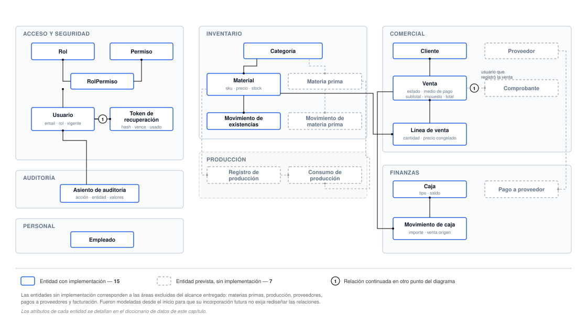

# Modelo de datos

Este capítulo describe la estructura de persistencia del sistema: sus convenciones, las entidades
que lo componen, las relaciones entre ellas y la estrategia de versionado del esquema.

## Alcance del modelo

El esquema define **veintidós entidades**. De ellas, **quince** cuentan con lógica de aplicación
que las utiliza; las **siete** restantes fueron modeladas previendo la incorporación futura de las
áreas excluidas del alcance entregado (Capítulo I) y no son manipuladas por ningún código.

Esta distinción se mantiene explícita a lo largo del capítulo. El diccionario de datos documenta
únicamente las entidades en uso; las restantes se enumeran al final, con el propósito de que el
lector comprenda la totalidad del diagrama sin atribuirle al sistema funciones que no posee.

<figure>
  
  <figcaption>Modelo de datos completo. Las entidades de trazo continuo cuentan con implementación; las de trazo punteado corresponden al modelo previsto para las áreas no incluidas en el alcance entregado.</figcaption>
</figure>

Modelar desde el inicio las entidades de las áreas diferidas fue una decisión deliberada: permite
que su incorporación posterior no exija rediseñar las relaciones ya existentes ni migrar datos
productivos. El costo asumido es un esquema más amplio que el estrictamente necesario.

## Convenciones de modelado

Las convenciones siguientes se aplican sin excepción en todo el esquema.

| Aspecto | Convención | Motivo |
|---|---|---|
| Clave primaria | Identificador universal único, generado por la base | Permite generar la clave antes de la inserción y no revela volumen de operación |
| Nombres físicos | Tablas y columnas en minúsculas con guion bajo | Convención habitual en el motor utilizado |
| Nombres lógicos | Camel case en el código, mapeados a los físicos | Convención habitual del lenguaje |
| Importes | Decimal de doce dígitos con dos decimales | Evita el error de representación binaria de los tipos de punto flotante |
| Cantidades | Decimal de doce dígitos con tres decimales | Admite unidades fraccionarias, como metros cúbicos |
| Marcas temporales | Fecha de creación y de última modificación, gestionadas por la capa de datos | Trazabilidad uniforme sin intervención de la aplicación |
| Bajas | Indicador booleano de vigencia | El sistema no elimina registros (RNF-03) |

### Sobre la representación de importes

La elección del tipo decimal merece justificación, porque constituye un requerimiento no funcional
(RNF-04) y no una preferencia estilística.

Los tipos de punto flotante no representan exactamente los valores decimales: la suma reiterada de
importes acumula un error que, en un sistema contable, termina produciendo diferencias de centavos
entre el detalle y el total. El tipo decimal almacena el valor con precisión exacta.

La misma precisión se sostiene en la capa de aplicación: los cálculos de totales no se realizan con
el tipo numérico nativo del lenguaje sino con una biblioteca de aritmética decimal (Capítulo VIII).

Una consecuencia visible de esta decisión es que los importes viajan al cliente **como cadenas de
texto** y no como números, precisamente para no perder precisión en la serialización. El cliente los
presenta con formato local y los convierte a número únicamente para previsualizar totales, sin valor
autoritativo.

### Sobre la baja lógica

Ninguna operación del sistema elimina registros. Las bajas se implementan marcando el registro como
no vigente, lo que preserva su historial y las referencias que otras entidades mantengan hacia él.

La consecuencia práctica es que una venta realizada a un cliente dado de baja posteriormente
conserva su integridad: el cliente sigue existiendo, la venta sigue siendo consultable y el reporte
histórico continúa siendo correcto.

En la interfaz de programación esta operación se expresa mediante el verbo `DELETE`, lo que puede
inducir a confusión. El verbo describe la intención del solicitante —dar de baja el recurso—, no la
operación física sobre la base.

## Diccionario de datos

Se documentan las entidades en uso, agrupadas por área. Por concisión se omiten las marcas
temporales, presentes en todas ellas conforme a la convención.

### Acceso y seguridad

#### Usuario

Cuenta de acceso al sistema.

| Campo | Tipo | Restricción | Descripción |
|---|---|---|---|
| `id` | Identificador | Clave primaria | — |
| `email` | Texto | **Único** | Identifica al usuario en el inicio de sesión |
| `passwordHash` | Texto | Obligatorio | Resultado de la función de derivación. Nunca la contraseña |
| `fullName` | Texto | Obligatorio | Nombre para mostrar |
| `roleId` | Identificador | Clave foránea a Rol | Determina los permisos |
| `isActive` | Booleano | Por omisión, verdadero | Vigencia de la cuenta |

Un usuario dado de baja no puede iniciar sesión ni renovar una sesión existente, y tampoco puede
solicitar el restablecimiento de su contraseña.

#### Rol, Permiso y su relación

El control de acceso se modela con tres entidades. Un **Rol** agrupa **Permisos** mediante una
relación de muchos a muchos explícita.

| Entidad | Campos relevantes | Descripción |
|---|---|---|
| Rol | `name` (único), `description`, `isActive` | Área funcional de la empresa |
| Permiso | `code` (único), `description` | Autorización con formato `módulo.acción` |
| RolPermiso | `roleId` + `permissionId` (clave compuesta) | Asignación de un permiso a un rol |

Los códigos de permiso siguen el patrón `módulo.acción`, por ejemplo `inventory.read` o
`commercial.create`. Existe un código comodín, `admin.*`, que concede la totalidad de los permisos y
se asigna exclusivamente al rol de Administración.

Modelar la relación de forma explícita, en lugar de dejar que la herramienta genere una tabla
intermedia implícita, permite consultarla y sembrarla directamente.

#### Token de recuperación de contraseña

Habilita el restablecimiento de la contraseña sin intervención de un administrador.

| Campo | Tipo | Restricción | Descripción |
|---|---|---|---|
| `id` | Identificador | Clave primaria | — |
| `userId` | Identificador | Clave foránea a Usuario, con borrado en cascada | Destinatario |
| `tokenHash` | Texto | **Único** | Resumen criptográfico del token. **Nunca el token en claro** |
| `expiresAt` | Fecha y hora | Obligatorio | Momento de vencimiento |
| `usedAt` | Fecha y hora | Opcional | Momento de consumo. Su ausencia indica token disponible |

El diseño de esta entidad responde a dos requerimientos de seguridad y se desarrolla en el Capítulo
VI. Resumidamente: se persiste el resumen y no el token, de modo que una filtración de la base no
habilite la toma de cuentas; y el campo de consumo garantiza el uso único.

### Inventario

#### Categoría

Clasificación de materiales.

| Campo | Tipo | Restricción | Descripción |
|---|---|---|---|
| `name` | Texto | Único junto con el tipo | Denominación |
| `type` | Enumerado | `RAW_MATERIAL` o `FINISHED_PRODUCT` | Clase de elemento que clasifica |
| `isActive` | Booleano | Por omisión, verdadero | Vigencia |

La unicidad es compuesta: pueden coexistir dos categorías homónimas si clasifican clases distintas.
En el alcance entregado únicamente se utiliza el segundo valor del enumerado.

#### Material

Producto elaborado por la fábrica y disponible para la venta.

| Campo | Tipo | Restricción | Descripción |
|---|---|---|---|
| `sku` | Texto | **Único** | Código de referencia |
| `name` | Texto | Obligatorio | Denominación |
| `categoryId` | Identificador | Clave foránea a Categoría | Clasificación |
| `unit` | Texto | Obligatorio | Unidad de medida: unidad, bolsa, metro cúbico |
| `currentStock` | Decimal (3 dec.) | Por omisión, cero | Existencia disponible |
| `salePrice` | Decimal (2 dec.) | Por omisión, cero | Precio vigente |
| `isActive` | Booleano | Por omisión, verdadero | Vigencia |

La existencia constituye un **valor desnormalizado**: podría derivarse sumando los movimientos, pero
se mantiene calculado para que la consulta de disponibilidad —la operación más frecuente del
sistema— no requiera una agregación. La consistencia entre ambos se garantiza actualizándolos
siempre dentro de la misma transacción.

Este campo no es modificable por la interfaz de programación de materiales: sólo cambia mediante
movimientos de existencias o por efecto de una venta.

#### Movimiento de existencias

Registro de cada variación de la existencia de un material.

| Campo | Tipo | Restricción | Descripción |
|---|---|---|---|
| `finishedProductId` | Identificador | Clave foránea a Material, indexada | Material afectado |
| `type` | Enumerado | `IN`, `OUT` o `ADJUST` | Naturaleza del movimiento |
| `quantity` | Decimal (3 dec.) | Obligatorio | Cantidad involucrada |
| `reference` | Texto | Opcional | Origen: identificador de la venta, motivo del ajuste |

Los tres valores del enumerado poseen semántica distinta y se originan en operaciones distintas:

| Valor | Efecto sobre la existencia | Origen |
|---|---|---|
| `IN` | La incrementa | Carga manual, o reposición por anulación de una venta |
| `OUT` | La decrementa | **Exclusivamente** el registro de una venta |
| `ADJUST` | La fija en el valor indicado | Corrección manual tras un recuento físico |

Que las salidas se originen únicamente en ventas es una restricción sostenida en el esquema de
validación: la interfaz de programación de movimientos no admite el valor `OUT`.

### Comercial

#### Cliente

| Campo | Tipo | Restricción | Descripción |
|---|---|---|---|
| `name` | Texto | Obligatorio | Razón social o nombre |
| `taxId` | Texto | Opcional, **sin unicidad** | Identificación tributaria |
| `email`, `phone`, `address` | Texto | Opcionales | Datos de contacto |
| `isActive` | Booleano | Por omisión, verdadero | Vigencia |

La ausencia de restricción de unicidad sobre la identificación tributaria es una característica del
modelo actual que conviene señalar: el sistema admite dos clientes con idéntico identificador.

#### Venta

Operación comercial. Es la entidad central del sistema.

| Campo | Tipo | Restricción | Descripción |
|---|---|---|---|
| `customerId` | Identificador | Clave foránea a Cliente, indexada | Comprador |
| `createdById` | Identificador | Clave foránea a Usuario, opcional, indexada | Usuario que la registró |
| `status` | Enumerado | `DRAFT`, `CONFIRMED`, `CANCELLED` | Estado |
| `paymentMethod` | Enumerado | Obligatorio | Medio de pago |
| `subtotal`, `tax`, `total` | Decimal (2 dec.) | Por omisión, cero | Importes |
| `soldAt` | Fecha y hora | Por omisión, el instante actual | Momento de la operación |

Dos observaciones sobre los valores efectivamente utilizados:

- El estado `DRAFT` se encuentra previsto en el modelo pero ninguna operación lo produce: toda venta
  nace confirmada. El ciclo de vida real comprende únicamente los otros dos estados.
- El campo de impuesto existe y se persiste, pero conserva el valor cero conforme a la restricción
  RE-03. Su presencia permite incorporar el tratamiento impositivo sin modificar la estructura.

El campo que identifica al usuario responsable admite valor nulo porque se incorporó mediante una
migración posterior al registro de las primeras ventas. Las anteriores a esa migración carecen del
dato, y tanto el reporte como la interfaz lo contemplan.

#### Línea de venta

| Campo | Tipo | Restricción | Descripción |
|---|---|---|---|
| `saleId` | Identificador | Clave foránea a Venta, **con borrado en cascada**, indexada | Venta a la que pertenece |
| `finishedProductId` | Identificador | Clave foránea a Material | Material vendido |
| `quantity` | Decimal (3 dec.) | Obligatorio | Cantidad |
| `unitPrice` | Decimal (2 dec.) | Obligatorio | **Precio congelado** al momento de la venta |
| `lineTotal` | Decimal (2 dec.) | Obligatorio | Importe de la línea |

El precio unitario se copia del precio vigente del material en el instante del registro y no
constituye una referencia a él. Es la implementación del requerimiento RF-17 y la razón por la cual
una modificación posterior del precio no altera las ventas ya registradas.

### Finanzas

#### Caja

| Campo | Tipo | Restricción | Descripción |
|---|---|---|---|
| `name` | Texto | Obligatorio | Denominación |
| `type` | Enumerado | `SALES` o `PAYMENTS` | Clase de caja |
| `balance` | Decimal (2 dec.) | Por omisión, cero | Saldo acumulado |
| `isActive` | Booleano | Por omisión, verdadero | Vigencia |

El sistema opera con una única caja, de tipo ventas, creada durante la carga de datos iniciales. El
segundo valor del enumerado corresponde al área de pagos a proveedores, excluida del alcance.

Al igual que la existencia de un material, el saldo es un valor desnormalizado que se mantiene
actualizado dentro de la misma transacción que genera cada movimiento.

#### Movimiento de caja

| Campo | Tipo | Restricción | Descripción |
|---|---|---|---|
| `cashRegisterId` | Identificador | Clave foránea a Caja, indexada | Caja afectada |
| `amount` | Decimal (2 dec.) | Obligatorio | **Positivo** para ingresos, **negativo** para reversiones |
| `description` | Texto | Opcional | Detalle legible |
| `saleId` | Identificador | Clave foránea a Venta, opcional | Venta que lo originó |

Representar las reversiones como movimientos de signo negativo, en lugar de eliminar el movimiento
original, preserva la trazabilidad: el histórico conserva tanto el ingreso como su posterior
reversión, y la suma de ambos es cero.

### Auditoría

#### Asiento de auditoría

| Campo | Tipo | Restricción | Descripción |
|---|---|---|---|
| `userId` | Identificador | Clave foránea a Usuario, opcional, indexada | Responsable de la operación |
| `action` | Texto | Obligatorio | `CREATE`, `UPDATE` o `DELETE` |
| `entity` | Texto | Obligatorio, indexada junto al identificador | Entidad afectada |
| `entityId` | Identificador | Obligatorio | Registro afectado |
| `oldValues` | Documento JSON | Opcional | Estado anterior |
| `newValues` | Documento JSON | Opcional | Estado posterior |

El uso de un tipo documental para los valores permite auditar entidades de estructura heterogénea
sin definir una tabla por cada una.

La entidad declara tres índices —por entidad y registro, por usuario y por fecha de creación—, que
corresponden exactamente a los tres criterios de consulta que ofrece la interfaz.

Los valores registrados admiten ausencia de forma deliberada. El restablecimiento de contraseña, por
ejemplo, genera un asiento **sin valores**: registrar el estado anterior y posterior implicaría
almacenar resúmenes de contraseña en la auditoría.

## Entidades modeladas sin implementación

Las siete entidades siguientes forman parte del esquema pero ningún código las manipula. Se
corresponden con las áreas excluidas del alcance entregado.

| Entidad | Área prevista |
|---|---|
| Materia prima | Inventario de materias primas |
| Movimiento de materia prima | Inventario de materias primas |
| Registro de producción | Producción |
| Consumo de producción | Producción |
| Proveedor | Comercial |
| Pago a proveedor | Finanzas |
| Comprobante | Facturación |

La entidad de materia prima incluye un campo de costo promedio ponderado, previsto para la
valorización de inventario. Su cálculo no se encuentra implementado.

La entidad de comprobante prevé los campos necesarios para la factura electrónica, incluido el
código de autorización del organismo fiscal. El sistema no integra con dicho organismo.

El Capítulo XIV retoma estas áreas como trabajo futuro.

## Versionado del esquema

El esquema se versiona mediante migraciones incrementales, almacenadas en el repositorio y aplicadas
en orden. Cada una registra su aplicación en la base, de modo que la herramienta puede determinar el
estado de cualquier entorno y aplicar únicamente lo pendiente.

| Migración | Contenido |
|---|---|
| Inicial | Las veintidós entidades, sus relaciones, índices y enumerados |
| Responsable de venta | Incorporación del usuario que registra cada venta |
| Recuperación de contraseña | Incorporación de la entidad de tokens de restablecimiento |

La escasez de migraciones posteriores a la inicial refleja la decisión de modelar desde el comienzo
el alcance completo: las dos incorporaciones posteriores obedecen a funcionalidades no contempladas
en el relevamiento original.

## Datos iniciales

Un procedimiento de carga inicial establece los datos mínimos para que el sistema resulte operable.
Es **idempotente**: puede ejecutarse repetidamente sin duplicar registros.

| Dato | Contenido |
|---|---|
| Permisos | Cuarenta y un códigos: diez módulos por cuatro acciones, más el comodín de administración |
| Roles | Los cinco roles de la organización |
| Asignaciones | Los permisos correspondientes a cada rol |
| Usuarios | Una cuenta por rol, para verificación del control de acceso |
| Categorías | Dos categorías iniciales de materiales |
| Caja | La caja de ventas, requerida para registrar operaciones |

La caja merece una nota: el registro de una venta **exige** su existencia y la rechaza con un error
explícito si no la encuentra. La carga inicial no es, por lo tanto, un conjunto de datos de ejemplo
sino un requisito de operación.

El catálogo de permisos incluye deliberadamente los códigos de los módulos no implementados. De este
modo, su incorporación futura no requerirá modificar la carga inicial ni ejecutar una migración de
datos.
