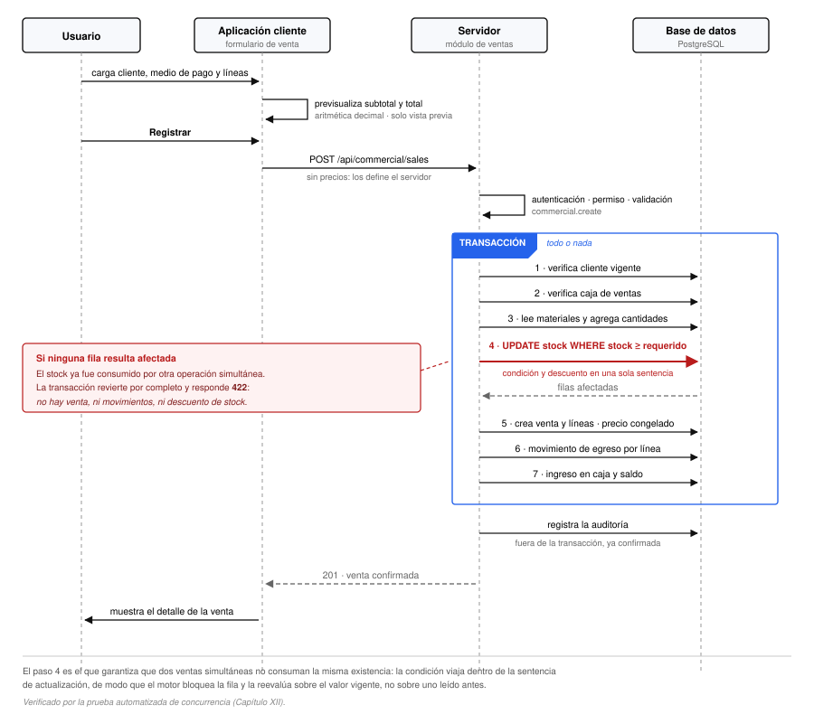

# El núcleo transaccional: registro y anulación de ventas

El registro de una venta es la operación más compleja del sistema y la que concentra sus garantías
de integridad. Modifica tres áreas de datos de forma indivisible —existencias, información comercial
y caja— y debe comportarse correctamente aunque dos operaciones concurran sobre el mismo material.

Este capítulo la desarrolla en detalle, junto con su operación inversa. Es el único que documenta
una función línea por línea, y la razón es que en ella se concentran las decisiones de diseño que
distinguen a un registro correcto de uno que funciona hasta que dos usuarios operan a la vez.

## El problema

Registrar una venta no consiste en insertar una fila. Una venta correcta implica, de forma
simultánea:

1. Verificar que el cliente se encuentre vigente.
2. Verificar que cada material exista, esté vigente y disponga de existencia suficiente.
3. Descontar la existencia de cada material.
4. Registrar la venta y sus líneas, con los precios vigentes.
5. Registrar un movimiento de egreso por cada línea.
6. Registrar el ingreso en la caja y actualizar su saldo.
7. Dejar constancia en la auditoría.

Si cualquiera de estos pasos se completara sin los demás, el sistema quedaría inconsistente: una
venta sin descuento de existencias, un descuento sin venta, o un ingreso de caja que no corresponde a
ninguna operación.

A esto se suma un problema que no se manifiesta en el uso individual pero sí en el real: **dos
usuarios pueden vender el mismo material al mismo tiempo**.

## Atomicidad

La totalidad de la operación se ejecuta dentro de una **transacción de base de datos**. O se
completa íntegramente, o no deja rastro alguno.

```ts
async create(dto: CreateSaleDto, actorId?: string) {
  const sale = await prisma.$transaction(async (tx) => {
    // … validaciones, descuento, creación, movimientos y caja
    return created;
  });

  await writeAuditLog({ userId: actorId, action: 'CREATE', ... });
  return sale;
}
```

Obsérvese que el registro de auditoría queda **fuera** de la transacción, ejecutándose una vez
confirmada. La razón es doble: si estuviera dentro, una reversión eliminaría también el asiento; y,
por diseño, un fallo de auditoría no debe impedir la operación de negocio (Capítulo VII).

Todas las operaciones internas utilizan el contexto transaccional, no el cliente de base de datos
global. Una sola que lo omitiera quedaría fuera del alcance de la reversión.

## Secuencia de la operación

<figure>
  
  <figcaption>Secuencia del registro de una venta. Los siete pasos del recuadro ocurren dentro de una única transacción; el cuarto es el que impide que dos operaciones simultáneas consuman la misma existencia.</figcaption>
</figure>

Los apartados siguientes desarrollan cada paso en el orden en que se ejecuta.

### Paso 1 — Verificación del cliente

```ts
const customer = await tx.customer.findUnique({ where: { id: dto.customerId } });
if (!customer || !customer.isActive) {
  throw AppError.badRequest('El cliente no existe o está inactivo');
}
```

Dado que las bajas son lógicas, un cliente dado de baja continúa existiendo en la base. La
verificación comprende ambas condiciones.

### Paso 2 — Verificación de la caja

```ts
const salesRegister = await tx.cashRegister.findFirst({ where: { type: 'SALES', isActive: true } });
if (!salesRegister) {
  throw AppError.badRequest('No hay una caja de ventas configurada. Ejecutá el seed.');
}
```

La caja se verifica **antes** de tocar las existencias. El orden importa: si se comprobara al final,
una instalación sin datos iniciales descontaría existencias y recién entonces fallaría. La
transacción revertiría el descuento, ciertamente, pero el trabajo se habría realizado en vano y el
diagnóstico resultaría menos evidente.

### Paso 3 — Agregación de cantidades por material

```ts
const requiredByProduct = new Map<string, Decimal>();
for (const item of dto.items) {
  const prev = requiredByProduct.get(item.finishedProductId) ?? new Decimal(0);
  requiredByProduct.set(item.finishedProductId, prev.plus(item.quantity));
}
```

Nada impide que una venta incluya el mismo material en dos líneas distintas. Verificar cada línea de
manera independiente contra la existencia disponible permitiría que dos líneas de sesenta unidades
superaran conjuntamente una existencia de cien, habiendo pasado ambas la verificación individual.

La agregación previa elimina el problema: la verificación y el descuento operan sobre la **cantidad
total requerida por material**, no por línea.

### Paso 4 — Verificación previa

```ts
for (const [productId, required] of requiredByProduct) {
  const product = productById.get(productId);
  if (!product || !product.isActive) {
    throw AppError.badRequest(`Producto inexistente o inactivo: ${productId}`);
  }
  if (new Decimal(product.currentStock.toString()).lessThan(required)) {
    throw AppError.unprocessable(
      `Stock insuficiente para ${product.name} (disponible ${product.currentStock}, requerido ${required})`,
    );
  }
}
```

Esta verificación cumple una función de **diagnóstico, no de garantía**. Su propósito es producir un
mensaje útil —con el nombre del material, la cantidad disponible y la requerida— antes de intentar el
descuento.

La existencia que aquí se consulta es meramente indicativa. La garantía real se encuentra en el paso
siguiente, y el motivo se desarrolla a continuación.

### Paso 5 — Descuento atómico y condicional

Es el núcleo de la operación.

```ts
for (const [productId, required] of requiredByProduct) {
  const product = productById.get(productId)!;
  const { count } = await tx.finishedProduct.updateMany({
    where: { id: productId, currentStock: { gte: required.toFixed(3) } },
    data:  { currentStock: { decrement: required.toFixed(3) } },
  });
  if (count === 0) {
    throw AppError.unprocessable(`Stock insuficiente para ${product.name}`);
  }
}
```

La sentencia resultante es, en esencia:

```sql
UPDATE finished_products
   SET current_stock = current_stock - :requerido
 WHERE id = :id AND current_stock >= :requerido;
```

**La condición viaja dentro de la sentencia de actualización.** La verificación y la modificación
constituyen una operación única e indivisible para el motor de base de datos, que bloquea la fila
mientras la ejecuta. Si la condición no se satisface, ninguna fila resulta afectada, el contador
devuelve cero y la operación se rechaza.

#### Por qué no basta con verificar y luego descontar

La alternativa evidente —consultar la existencia, compararla y descontarla si alcanza— presenta un
defecto que sólo se manifiesta bajo concurrencia, conocido como *actualización perdida*.

Considérese un material con cien unidades disponibles y dos ventas simultáneas de sesenta cada una:

| Momento | Operación A | Operación B | Existencia |
|---|---|---|---|
| t₁ | Lee: 100 | | 100 |
| t₂ | | Lee: 100 | 100 |
| t₃ | Compara: 100 ≥ 60 ✓ | | 100 |
| t₄ | | Compara: 100 ≥ 60 ✓ | 100 |
| t₅ | Escribe: 100 − 60 = 40 | | 40 |
| t₆ | | Escribe: 100 − 60 = 40 | **40** |

Ambas operaciones se confirman. Se vendieron ciento veinte unidades de una existencia de cien, y la
base registra cuarenta restantes cuando debería registrar menos veinte. **El sistema vendió mercadería
que no existe.**

El defecto no reside en la lógica sino en la separación temporal entre la lectura y la escritura.
Entre ambas, el valor leído dejó de ser válido.

Con el descuento condicional, la misma secuencia se comporta así:

| Momento | Operación A | Operación B | Existencia |
|---|---|---|---|
| t₁ | `UPDATE … WHERE stock ≥ 60` → 1 fila | | 40 |
| t₂ | | `UPDATE … WHERE stock ≥ 60` → **0 filas** | 40 |
| t₃ | Continúa | **Rechaza con 422 y revierte** | 40 |

La operación B encuentra la condición incumplida, obtiene cero filas afectadas y revierte por
completo. La existencia final es correcta y únicamente una de las dos ventas se confirmó.

#### Sobre el bloqueo

El motor de base de datos bloquea la fila mientras ejecuta la actualización. Si dos transacciones
intentan modificar el mismo registro, la segunda aguarda a que la primera concluya y **reevalúa la
condición sobre el valor actualizado**. De ahí que la comprobación resulte confiable: no se evalúa
sobre un valor leído previamente sino sobre el vigente en el instante de la modificación.

El alcance del bloqueo se limita a las filas afectadas. Dos ventas de materiales distintos no se
interfieren.

### Paso 6 — Construcción de las líneas y congelamiento del precio

```ts
let subtotal = new Decimal(0);
const detailRows = dto.items.map((item) => {
  const product = productById.get(item.finishedProductId)!;
  const unitPrice = new Decimal(product.salePrice.toString());
  const lineTotal = unitPrice.times(item.quantity);
  subtotal = subtotal.plus(lineTotal);
  return {
    finishedProductId: item.finishedProductId,
    quantity: item.quantity,
    unitPrice: unitPrice.toFixed(2),
    lineTotal: lineTotal.toFixed(2),
  };
});
```

Dos decisiones convergen en este fragmento.

**El precio se toma del material, nunca del cliente.** El cuerpo de la petición no incluye precios:
el esquema de validación admite únicamente el identificador del material y la cantidad. Aunque un
cliente manipulado los enviara, serían ignorados. El precio es autoridad exclusiva del servidor.

**El precio se copia, no se referencia.** El valor queda persistido en la línea de venta. Una
modificación posterior del precio del material no altera las ventas ya registradas. Sin este
congelamiento, un cambio de lista reescribiría retroactivamente el historial comercial y los
reportes de períodos cerrados arrojarían resultados distintos en cada consulta.

### Paso 7 — Precisión de los importes

Los cálculos no se realizan con el tipo numérico nativo del lenguaje sino con una biblioteca de
aritmética decimal.

El tipo nativo representa los valores en punto flotante binario, incapaz de expresar exactamente
ciertos decimales. La consecuencia es conocida: la suma de `0,1` y `0,2` no produce exactamente
`0,3`. Sobre un importe aislado el error resulta imperceptible; acumulado sobre las líneas de miles
de ventas, produce diferencias de centavos entre el detalle y el total.

La biblioteca opera con precisión decimal exacta y los valores se persisten en columnas de tipo
decimal (Capítulo V), de modo que la precisión se mantiene en todo el trayecto.

Conforme a la restricción RE-03, el importe total coincide con el subtotal y el impuesto se persiste
en cero. El campo existe, de modo que su incorporación futura no requiera alterar la estructura.

### Paso 8 — Persistencia y efectos

La venta se crea junto con sus líneas en una única operación:

```ts
const created = await tx.sale.create({
  data: {
    customerId: dto.customerId,
    createdById: actorId ?? null,
    status: 'CONFIRMED',
    paymentMethod: dto.paymentMethod,
    subtotal: subtotal.toFixed(2),
    tax: '0',
    total: total.toFixed(2),
    details: { create: detailRows },
  },
  include: saleInclude,
});
```

A continuación se registran los dos efectos colaterales.

**Movimiento de egreso por línea**, referenciando la venta que lo originó. Esto permite que el
historial de un material responda por qué varió su existencia en cada momento.

**Ingreso en la caja y actualización del saldo**, dentro de la misma transacción:

```ts
await tx.cashMovement.create({
  data: { cashRegisterId: salesRegister.id, amount: total.toFixed(2),
          description: `Venta a ${customer.name}`, saleId: created.id },
});
await tx.cashRegister.update({
  where: { id: salesRegister.id },
  data:  { balance: { increment: total.toFixed(2) } },
});
```

El saldo constituye un valor desnormalizado (Capítulo V). Que el movimiento y la actualización del
saldo ocurran en la misma transacción es lo que garantiza su correspondencia.

Conforme a la restricción RE-04, el ingreso se registra **cualquiera sea el medio de pago**, incluidos
cheque y cuenta corriente. Así lo especificó el cliente.

## Anulación

La anulación revierte una venta confirmada. Su diseño es el inverso exacto del registro y presenta la
misma estructura de garantías.

### Protección del estado

```ts
const { count } = await tx.sale.updateMany({
  where: { id, status: 'CONFIRMED' },
  data:  { status: 'CANCELLED' },
});
if (count === 0) throw AppError.unprocessable('La venta ya no está confirmada');
```

Es el mismo mecanismo del descuento de existencias aplicado a una transición de estado. La condición
viaja dentro de la actualización, de modo que **ante dos anulaciones simultáneas únicamente una
prospera**. La segunda encuentra cero filas afectadas y revierte.

Sin esta protección, dos anulaciones concurrentes repondrían las existencias dos veces y revertirían
la caja dos veces, a partir de una única venta.

### Reposición y reversión

La reposición genera un movimiento de ingreso por cada línea, con una referencia que identifica su
origen, e incrementa la existencia agregada por material.

La reversión de caja genera un movimiento **de importe negativo** por cada ingreso de la venta y
decrementa el saldo:

```ts
for (const mov of current.cashMovements) {
  const amount = new Decimal(mov.amount.toString());
  await tx.cashMovement.create({
    data: { cashRegisterId: mov.cashRegisterId, amount: amount.negated().toFixed(2),
            description: `Anulación de venta a ${current.customer.name}`, saleId: id },
  });
  await tx.cashRegister.update({
    where: { id: mov.cashRegisterId },
    data:  { balance: { decrement: amount.toFixed(2) } },
  });
}
```

Registrar la reversión como un movimiento adicional, en lugar de eliminar el original, preserva la
trazabilidad: el histórico conserva ambos y su suma es cero.

La reversión itera sobre los movimientos efectivamente registrados por la venta, y no sobre su
importe. Esto permite anular correctamente las ventas registradas antes de que la caja se
incorporara al sistema: al no poseer movimientos asociados, se anulan sin afectar el saldo.

### Independencia del estado del cliente

La anulación **no verifica que el cliente continúe vigente**. Es una decisión deliberada,
documentada en el código: se trata de una operación correctiva, y la baja del cliente no debe
impedir la corrección de un error.

## Verificación empírica

Las garantías descritas no se afirman: se verifican. La suite de pruebas incluye tres casos que las
comprueban contra una base de datos real (Capítulo XII).

### Reversión completa ante existencia insuficiente

Intenta una venta que excede la existencia disponible y comprueba, tras el rechazo, que **no se creó
la venta, no se generaron movimientos y la existencia permanece inalterada**. Verifica que la
reversión sea efectivamente total y no parcial.

### Concurrencia

> *«Ante dos ventas simultáneas que exceden el stock, sólo una se confirma.»*

Es la prueba decisiva del capítulo. Dispara dos peticiones de venta en paralelo sobre un material
cuya existencia alcanza para una sola, y verifica que exactamente una se confirme, que la otra sea
rechazada y que la existencia final resulte correcta.

Sin esta prueba, la corrección del descuento condicional sería una afirmación de diseño. Con ella, es
un resultado verificado y reproducible.

### Ciclo completo de anulación

Registra una venta, comprueba el descuento de existencias y el incremento del saldo, la anula, y
comprueba que ambos valores regresen exactamente a su estado previo. Verifica a continuación que un
segundo intento de anulación sea rechazado.

## Síntesis

La operación aplica cuatro garantías, cada una respondiendo a un riesgo concreto:

| Garantía | Mecanismo | Riesgo que evita |
|---|---|---|
| Atomicidad | Transacción de base de datos | Estados intermedios inconsistentes |
| Aislamiento bajo concurrencia | Actualización condicional con bloqueo de fila | Venta de existencia inexistente |
| Estabilidad histórica | Copia del precio en la línea | Reescritura retroactiva del historial comercial |
| Exactitud monetaria | Aritmética y almacenamiento decimales | Diferencias acumuladas por redondeo |

El costo de estas garantías es una función considerablemente más extensa que una inserción simple.
Se trata de una inversión deliberada: es la operación que sostiene la actividad comercial del cliente
y la única cuyo fallo produciría discrepancias entre el sistema y el inventario físico.
